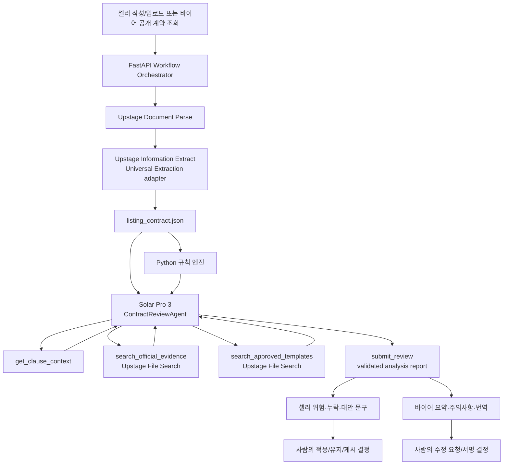
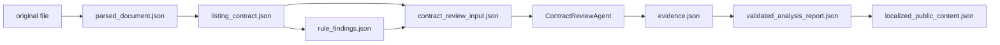

> 작성 기준일: 2026-07-28
> 
> 
> 버전: Special-challenge-aligned MVP v1.2
> 
> 관련 문서: `API_SPEC.md`, `DB_SCHEMA.md`, `RAG_KNOWLEDGE_BASE.md`
> 
> 목적: AI 담당자와 백엔드 담당자가 계속 참고하는 구현 기준 문서
> 

## 1. 결론

첨부된 AI 설계의 핵심 방향은 적절하다.

```
Document Parse
→ Information Extract(Upstage Universal Extraction adapter)
→ 규칙 엔진
→ Solar Pro 3 단일 ContractReviewAgent
→ Agent가 Files / Vector Store / File Search 도구를 필요할 때 호출
→ 근거가 고정된 위험 설명·수정 문구 생성
```

다만 현재 와이어프레임과 서비스 정의에 맞게 다음을 수정한다.

| 기존 아이디어 | 최종 결정 | 이유 |
| --- | --- | --- |
| 바이어 유형이 불명확 | 바이어는 관광상품을 직접 계약하는 외국인 개인 | 현재 와이어프레임의 개인 가입·검토·수정 요청·서명 흐름을 기준으로 한다. |
| Frontier 총괄 Agent가 모든 작업 지휘 | FastAPI workflow가 전체 단계를 결정적으로 조율 | 해커톤에서 별도 Frontier 모델은 비용·지연·운영 복잡도를 높이고 Upstage 활용도가 흐려진다. |
| 여러 Solar sub-agent가 자율적으로 서로 호출 | 계약 검토에만 Solar Pro 3 단일 Agent를 사용 | 계약 검토는 발견한 위험에 따라 근거를 다시 검색할 필요가 있지만 나머지 작업은 고정 호출로 충분하다. |
| Agent가 파싱·생성·번역·서명까지 수행 | 파싱·추출·초안·요약·번역은 고정 task, 상태 변경·서명은 일반 코드 | 입력과 출력이 정해진 작업에 Agent를 쓰면 비용·오류·재현성 부담만 커진다. |
| AI가 과거 계약을 참고해 예상 가격 계산 | 규칙 엔진이 금액 계산, AI는 근거를 설명 | LLM이 계약 금액을 직접 계산하면 오차와 근거 불일치 위험이 있다. |
| B2B와 개인 계약 근거가 혼합됨 | 외국인 개인 관광객 계약에 맞는 공식 소비자·관광 계약 자료를 우선하되 자동 법률 판정은 금지 | buyer가 개인이므로 소비자 관점의 취소·환불·책임 설명이 핵심이다. |
| 바이어 화면에서 요청마다 번역·요약 생성 | 공고 publish 시 언어별 결과를 사전 생성·캐시 | 공개 목록의 속도와 비용을 안정화한다. |
| RAG 검색 결과가 위험 여부 판정 | RAG는 근거 후보만 제공 | 최종 화면은 법률 판정이 아니라 계약 검토 보조 의견이다. |
| 상품 분류가 숙박·레저·스포츠·패키지로 혼재 | 자동차 렌탈·액티비티·투어·숙박으로 통일 | 특별상 과제의 관광 거래 범위를 API·DB·RAG에서 같은 값으로 사용한다. |
| 다국어 MVP가 한 언어로 제한 | 한국어·영어·일본어·중국어를 동일 pipeline으로 지원 | 과제의 외국인 언어 장벽 해결을 기능으로 증명한다. |

한 줄 정의:

> **Busan Link의 AI는 셀러가 작성한 관광상품 이용·공급 계약을 구조화하고, 역할별 위험 후보와 근거를 생성하며, 외국인 개인 바이어가 자신의 언어로 이해할 수 있게 설명하는 계약 검토 보조 시스템이다.**
> 

## 2. 사용자와 AI 결과 범위

### 셀러

부산의 자동차 렌탈·액티비티·투어·숙박 업체다.

AI 제공 기능:

- PDF 계약서 구조 인식과 핵심 조건 추출
- 직접 입력 조건을 기반으로 계약 초안 생성
- 셀러에게 불리하거나 모호할 수 있는 조항 탐지
- 누락된 필수 조건 확인
- 대안 문구 제안
- 바이어 공개용 공고 요약 생성

### 바이어

부산 관광상품을 직접 계약하고 이용하는 외국인 개인이다.

AI 제공 기능:

- 공개 계약 핵심 조건 요약
- 바이어에게 불리하거나 모호할 수 있는 조항 탐지
- 계약서 원문의 쉬운 설명과 번역
- 취소·노쇼·정산·수량 변경·책임 조항 체크리스트
- 셀러에게 보낼 조항별 수정 요청 초안
- 단체 여행이면 대표자로서 확인해야 할 인원 변경·취소·대표 권한 안내

### 단체 여행 바이어

단체 여행이어도 buyer account와 계약 당사자는 외국인 개인이다. 단체명은 선택 정보이며 별도 organization을 만들지 않는다.

MVP의 `단체서명`은 참가자 전원이 각각 전자서명하는 방식이 아니다. 대표자 1명이 단체를 대표해 서명하고, 시스템은 다음 정보를 계약과 감사 이력에 기록한다.

- 대표 개인의 이름과 이메일
- 선택적 단체명
- 참가 인원
- `group_representative` 서명 자격
- 대표 권한 확인 시각과 대상 계약 version

## 3. 최종 아키텍처

공통 구현은 `backend/app/ai` 아래에서 provider, task, agent, tool, prompt, schema를 분리한다.
개발·테스트 기본 provider는 `fake`이며 `AI_PROVIDER=upstage`와 API key를 명시한 환경에서만
실제 Upstage adapter를 구성한다.

```text
backend/app/ai/
├── providers/      # protocol, deterministic fake, Upstage HTTP adapter
├── schemas/        # Pydantic provider input/output
├── tasks/          # 고정 task registry
├── agents/         # contract_review 전용
├── tools/          # 네 개 도구 allowlist
└── prompts/v1/     # versioned prompt constants
```



### 왜 FastAPI가 orchestrator이고 계약 검토만 Agent인가

FastAPI domain service는 job type, 권한, version, 재시도와 상태 전이를 고정된 순서로 통제한다.

```
document uploaded
→ parse
→ extract
→ rule check
→ ContractReviewAgent 실행
   → 필요 시 조항 문맥 조회
   → 필요 시 공식 근거/승인 템플릿 검색
   → 최대 2회 검색 보정
   → submit_review
→ save result
```

장점:

- 단계별 재시도와 실패 원인을 추적할 수 있다.
- 동일 입력에 불필요한 중복 모델 호출을 방지한다.
- 공고 version, prompt version, model name을 정확히 연결할 수 있다.
- 일부 단계가 실패해도 이미 성공한 결과를 재사용할 수 있다.
- 데모에서 fake provider로 동일한 흐름을 재현할 수 있다.

계약 검토는 조항마다 필요한 근거가 다르고, 첫 검색 결과가 부족하면 질의를 좁혀 다시 검색해야 하므로 제한된 Agent가 유효하다. 반면 Document Parse, Information Extract, 초안 생성, 공개 요약, 번역은 입력과 출력 schema 및 실행 순서가 고정돼 있어 일반 함수가 더 적합하다.

`ContractReviewAgent`는 자유로운 범용 Agent가 아니다. 허용 도구, 최대 반복 횟수, 출력 JSON Schema를 제한한 bounded single agent다. 계약 수정, DB 상태 변경, 전자서명 요청 도구는 제공하지 않는다. Upstage Agents API를 사용할 수 있으면 provider adapter로 연결하고, 그렇지 않으면 Solar Pro 3 tool-calling loop를 FastAPI 안에서 동일 interface로 구현한다.

## 4. Upstage 기능별 역할

### 4.1 Document Parse

셀러가 기존 계약서 PDF·이미지·DOCX를 등록할 때만 사용한다.

입력:

- 계약서 파일
- OCR 처리 여부
- 표/레이아웃 처리 옵션

출력에서 보존해야 할 값:

- 페이지 번호
- 조항 제목과 본문
- 표 구조
- 문단 순서
- bounding box 또는 원문 위치 정보
- parse된 Markdown/HTML

원문 위치를 유지해야 계약서 왼쪽 화면에서 위험 문장을 정확히 하이라이트할 수 있다.

Upstage 공식 예시는 `POST <https://api.upstage.ai/v1/document-digitization`과> `model=document-parse`를 사용한다. 구현 시 endpoint와 요청 옵션은 프로젝트 콘솔의 현재 API 문서를 다시 확인한다.

### 4.2 Information Extract

과제와 domain/API에서는 이 단계를 `Information Extract`라고 부른다. 실제 Upstage 콘솔·SDK에서 제공되는 기능명이 `Universal Extraction`이면 integration adapter가 그 기능을 호출하되, job type은 계속 `information_extract`를 사용한다.

Document Parse 결과를 다음 JSON schema로 변환한다.

```json
{
  "document_type": "accommodation_supply_contract",
  "language": "ko-KR",
  "parties": {
    "seller": {
      "name": "해운대 오션스테이",
      "registration_no": null
    },
    "buyer": {
      "name": null
    }
  },
  "product": {
    "title": "2026 부산 여름 객실 공급",
    "category": "accommodation",
    "district": "해운대구"
  },
  "supply": {
    "start_date": "2026-07-01",
    "end_date": "2026-08-31",
    "quantity": 30,
    "quantity_unit": "room",
    "minimum_people": 20
  },
  "price": {
    "amount_minor": 145000,
    "currency": "KRW",
    "unit": "room_night"
  },
  "service_period": {
    "start_date": "2026-07-01",
    "end_date": "2026-08-31",
    "raw_text": "2026년 7월 1일부터 8월 31일까지"
  },
  "cancellation": {
    "free_cancellation_days": 7,
    "late_penalty_rate": 50,
    "no_show_penalty_rate": 100,
    "raw_text": "체크인 7일 전까지 무료 취소"
  },
  "refund": {
    "method": "original_payment_method",
    "deadline_days": null,
    "raw_text": null,
    "missing": true
  },
  "safety": {
    "operator_obligations": [],
    "customer_rules": [],
    "insurance": null,
    "emergency_response": null,
    "raw_text": null,
    "missing": true
  },
  "compensation": {
    "trigger": null,
    "method": null,
    "limit": null,
    "raw_text": null,
    "missing": true
  },
  "liability": {
    "seller_scope": null,
    "buyer_scope": null,
    "exclusions": [],
    "raw_text": null,
    "missing": true
  },
  "clauses": [],
  "extraction_warnings": []
}
```

각 leaf 값은 실제 저장 전 다음 provenance를 함께 가질 수 있어야 한다.

```json
{
  "value": 145000,
  "confidence": 0.96,
  "source_page": 2,
  "source_quote": "객실당 145,000원"
}
```

confidence가 낮거나 서로 충돌하는 값은 자동 확정하지 않고 seller confirmation 항목으로 보낸다.
Upstage Universal Extraction의 confidence 원문은 `high`/`low` 등급이므로 adapter에서 내부
검증용 값 `1.0`/`0.0`으로 정규화한다. 이는 확률 추정치가 아니라 provider 등급의 손실 없는
이진 매핑이다. API에는 `location=true`, `location_granularity=element`를 전달하고 반환된 page와
정규화 좌표를 `source_page`, `bbox`로 보존한다.

`price`, `service_period`, `cancellation`, `refund`, `safety`, `compensation`, `liability`는 과제 요구사항의 필수 top-level key다. 문서에 항목이 없더라도 key를 생략하지 않고 `null`, `missing=true`로 반환해 누락 위험을 탐지한다. 정산, 노쇼, 최소 인원, 기상 취소 등은 카테고리별 확장 field로 함께 추출한다.

### 4.3 Solar Pro 3

Solar Pro 3는 고정 task 함수들과 하나의 계약검토 Agent에서 사용한다.

| 실행 형태 | task | 입력 | 출력 | 호출 시점 |
| --- | --- | --- | --- | --- |
| 고정 함수 | `contract_generate` | 셀러 입력 조건 + 사전에 검색한 승인 템플릿 근거 | 계약 조항 초안 | 직접 작성 |
| 단일 Agent | `contract_review` | 특정 version 조항 + 구조화 조건 + 규칙 결과 + viewer role | 근거가 연결된 위험·누락·대안 문구 | 작성/업로드/공개 전 |
| 고정 함수 | `public_summary` | 공개 version + seller description | 카드/상세 요약 | publish 전 |
| 고정 함수 | `localize_explain` | 확정된 공개 결과 + 대상 locale | 번역·쉬운 설명 | publish 전 또는 새 언어 요청 시 |
| 고정 함수 | `revision_draft` | finding + 바이어 요구 | 수정 요청 문구 초안 | 바이어가 수정 요청 선택 시 |

공식 콘솔 예시에서 Solar Chat/Reasoning은 OpenAI-compatible `chat.completions`와 `model=solar-pro3`를 사용하고 reasoning 요청에는 `reasoning_effort`를 설정할 수 있다.

모든 task는 서로 다른 system prompt와 JSON Schema를 사용한다. 고정 함수의 prompt는 함수 내부에서 선택하며 중앙 Agent가 대신 명령하지 않는다.

`contract_review`에만 다음 도구를 제공한다.

| 도구 | 입력 | 반환 | 제한 |
| --- | --- | --- | --- |
| `get_clause_context` | `clause_id`, 앞뒤 조항 수 | 원문, page, bbox, 인접 조항 | 현재 version만 조회 |
| `search_official_evidence` | 한국어 query, category, 기준일 | 공식 PDF의 page, excerpt, score | `common + 현재 category`만 검색 |
| `search_approved_templates` | clause type, category | 승인 템플릿 문구와 version | 공식 근거로 표시하지 않음 |
| `submit_review` | Finding JSON 배열 | schema 검증된 최종 결과 | 한 번만 호출, DB 직접 쓰기 불가 |

Agent는 최대 2회의 검색 iteration만 허용한다. 충분한 근거가 없으면 검색을 반복해서 꾸며내지 않고 `grounding_status=insufficient_evidence`로 종료한다.

### 4.4 Files, Vector Store, File Search

RAG의 저장소, 공식 파일 목록, ingestion, 검색 및 근거 페이지 이동의 상세 기준은 `RAG_KNOWLEDGE_BASE.md`를 따른다.

RAG는 두 저장소를 논리적으로 분리한다.

| 저장소 | 자료 | 사용 목적 |
| --- | --- | --- |
| `official_contract_knowledge` | 공식 법령·표준약관·공식 분쟁 기준·관광업 공식 지침 | 위험 설명의 외부 근거 후보 |
| `busan_link_templates` | 팀이 승인한 개인 관광객용 자동차 렌탈·액티비티·투어·숙박 계약 템플릿과 clause library | 계약 생성과 대안 문구 |

선택적 세 번째 저장소:

| 저장소 | 자료 | 조건 |
| --- | --- | --- |
| `approved_historical_contracts` | 비식별화되고 사용 승인을 받은 과거 계약 | 개인정보 제거와 사용 권한이 확인된 경우만 |

MVP에서는 세 번째 저장소를 만들지 않는다. 셀러가 업로드한 사용자 계약서는 공용 Vector Store에 올리지 않고 Document Parse/Information Extract 결과를 조항별로 직접 분석한다. 실제 provider 기능명이 Universal Extraction이면 adapter 내부에서만 매핑한다. Vector Store는 검수된 공식 근거 PDF와 팀 승인 템플릿에만 사용한다.

공식 자료는 PDF를 그대로 Files API에 업로드한다. Markdown 변환은 필수가 아니며, 텍스트가 없는 스캔 PDF나 검색 품질이 기준에 미달한 문서만 Document Parse/OCR 또는 정규화 대상으로 돌린다. 국내여행 표준약관은 `common`에 한 번 저장하지만 검색 metadata는 `contract_categories=["tour"]`로 제한한다.

문서 metadata:

```json
{
  "document_id": "uuid",
  "title": "숙박 공급 계약 표준 템플릿",
  "source_type": "approved_template",
  "jurisdiction": "KR",
  "contract_category": "accommodation",
  "party_type": "B2C_individual",
  "effective_from": "2026-01-01",
  "effective_to": null,
  "version": "1.2",
  "source_url": null,
  "approved_by": "team",
  "approved_at": "2026-07-28T00:00:00Z"
}
```

검색은 category, 개인 소비자/사업자 계약 구분, 시행일, 문서 유형 metadata로 먼저 좁힌 뒤 semantic search를 수행한다.

공식 소비자·관광 계약 자료는 개인 바이어의 취소·환불·추가 비용·안전·책임 설명에 사용할 수 있다. 다만 검색 결과 하나만으로 특정 조항을 위법·무효라고 판정하지 않고, 적용 범위와 시행일이 확인되지 않으면 `insufficient_evidence`로 표시한다.

## 5. 규칙 엔진

규칙 엔진은 Python 코드로 구현하며 Solar보다 먼저 실행한다.

### 공통 검사

- 계약명, 당사자, 상품 유형, 부산 지역 누락
- 공급 기간 시작일이 종료일보다 늦음
- 수량·단가·통화·가격 단위 누락
- 최소 인원이 최대 인원보다 큼
- 취소 기한과 위약금 기준 누락
- 노쇼 기준 누락
- 정산 주기 또는 지급기한 누락
- 계약 조항과 구조화 값의 숫자 불일치
- 원문과 번역문의 금액·날짜·비율 불일치

### 카테고리별 검사

자동차 렌탈:

- 대여 요금, 보증금, 연료·반납·지연 비용 누락
- 보험 종류·보장 범위·자기부담금 누락
- 사고 시 사업자 전면 면책 또는 소비자 일방 부담
- 차량 파손·휴차료의 산정 기준 누락
- 국제운전면허 등 이용 자격과 취소 기준 누락

숙박:

- 객실 수와 room/room-night 단위 혼동
- 체크인 기준 취소 기한 누락
- 노쇼 비용 누락

액티비티:

- 기상 취소 기준 누락
- 최소 운영 인원 누락
- 안전 책임·보험·이용 제한 누락

투어:

- 구성 상품과 공급 책임 주체 누락
- 일부 상품 취소 시 전체 환불 기준 누락
- 수수료와 정산 기준 누락

규칙 엔진 결과와 Solar 결과가 같은 문제를 찾으면 중복 finding을 합치되, 규칙 엔진의 숫자·날짜 결과를 우선한다.

## 6. 와이어프레임별 AI 실행 흐름

### 6.1 셀러가 PDF 계약서를 등록

```
Storage upload 완료
→ POST /documents/{id}/complete로 파일 검증
→ POST /documents/{id}/process로 비용 작업 명시적 시작
→ Document Parse
→ Information Extract
→ seller 확인이 필요한 낮은 confidence 값 표시
→ listing version/clauses 후보 생성
→ 규칙 엔진
→ seller ContractReviewAgent
→ Agent가 필요한 RAG 근거 검색
→ 근거가 연결된 위험·대안 문구 생성
→ 셀러가 적용 또는 유지
```

DB/API 연결:

- `documents`
- `ai_jobs`: document_parse, information_extract, risk_analysis
- `listing_versions`, `listing_clauses`
- `ai_analysis_runs`, `ai_findings`
- `POST /documents/{id}/complete`
- `POST /documents/{id}/process`
- `GET /ai-jobs/{id}`
- `GET /documents/{id}/processing-result`

### 6.2 셀러가 직접 작성

```
listing_terms 입력
→ 규칙 엔진으로 필수값 확인
→ 템플릿 File Search
→ Solar contract_generate 고정 함수
→ JSON Schema와 숫자·날짜·단위 보존 검사
→ 새 listing version 생성
→ seller ContractReviewAgent
→ 셀러 수정
```

`contract_generate`는 `base_version_no`와 Idempotency-Key를 기준으로 실행을 선점하고 listing을
`processing`으로 전이한다. 승인 metadata가 명시된 template hit만 참고 문맥으로 사용하며 공식
법적 근거로 표시하지 않는다. Solar 출력은 조항 순서·key·title·body만 반환하고, version 번호,
hash, 상태 전이와 DB 저장은 애플리케이션 코드가 담당한다. 입력에 없는 숫자나 날짜가 추가되거나
단가·기간·수량·단위가 누락되면 저장하지 않고 `draft`로 복구한다. 성공 시 기존 version을
수정하지 않고 새 version과 clauses를 하나의 transaction으로 저장한 뒤 `ready`로 전이하며 자동
게시하지 않는다.

`임시저장`은 필수값이 없어도 가능하다. `작성 완료`에서만 필수값과 AI 처리 상태를 검사한다.

### 6.3 셀러가 공고를 공개

publish 전에 다음 결과를 생성한다.

- buyer 관점 ContractReviewAgent 결과
- 공개 카드 한 줄 요약
- 상세 핵심 조건 요약
- 기본 지원 언어별 쉬운 설명

공개 목록 요청마다 Solar를 호출하지 않는다. 동일한 `listing_version_id + locale + prompt_version` 결과를 재사용한다.

공고 version이 바뀌면 이전 요약과 번역은 stale 처리하고 다시 생성한다.

### 6.4 바이어가 공고를 탐색

AI가 하는 일:

- 미리 생성한 카드 요약 제공
- 공고 상세의 쉬운 핵심 조건 제공
- 선택 언어의 설명 제공

AI가 하지 않는 일:

- 요청할 때마다 추천 순위 생성
- 예상 금액 직접 계산
- 공개되지 않은 셀러 분석 결과 노출

추천순은 검증 상태, 정보 완성도, 계약 가능 여부, 인기도를 backend score로 계산한다. 계약 가능 여부는 별도 boolean이 아니라 `published=true`, `paused=false`로 계산한다. 예상 가격은 사용자가 명시한 인원·과금 수량·단위·박수·기간과 기준 단가·환율을 코드로 계산하고 Solar는 설명만 생성한다. 공개 화면의 반복 preview 계산은 기본적으로 저장하지 않고 계약 요청에 사용된 계산만 snapshot한다.

### 6.5 바이어가 계약서 원문을 검토

- 왼쪽 원문의 clause id/source location과 finding을 연결한다.
- 오른쪽 AI 패널에는 buyer 관점 결과만 표시한다.
- seller 내부 분석, prompt, 전체 RAG corpus는 노출하지 않는다.
- 위험도와 중요도를 별도 표시한다.

### 6.6 바이어가 수정 요청

Solar는 바이어가 선택한 finding과 자유 입력을 조항별 수정 요청 초안으로 바꿀 수 있다.

```json
{
  "clause_id": "uuid",
  "request_type": "cancellation_policy",
  "reason": "무료 취소 기한이 명확하지 않습니다.",
  "requested_text": "체크인 7일 전까지 무료 취소로 명시해 주세요."
}
```

초안은 자동 전송하지 않는다. 바이어가 수정하고 `보내기`를 눌러야 한다.

셀러의 항목별 수락·기각·대안 제시는 일반 계약 workflow이며 AI가 결정하지 않는다. `countered` 선택 시 대안 문구 작성을 보조할 수 있다.

### 6.7 표준 안전장치 적용

Solar가 만든 `suggested_text`는 자동으로 계약서에 쓰지 않는다.

```
공식 근거/승인 템플릿 검색
→ 표준 안전장치 후보 생성
→ 사용자가 원문·근거·추천 문구 비교
→ 적용 또는 기각
→ 적용 시 immutable 새 version 생성
→ 규칙 엔진과 역할별 분석 재실행
```

`suggested_text_hash`와 분석 대상 version을 함께 검사해 오래된 추천 문구가 최신 계약에 잘못 적용되지 않게 한다. 적용·기각·사용자 편집은 모두 audit event에 남긴다.

구현 API는 셀러 조직 구성원만 호출할 수 있고 모든 action POST에 `Idempotency-Key`를 요구한다.
적용은 원본 조항과 version을 수정하지 않고 새 version/clauses를 생성한 뒤 seller와 buyer 관점
`risk_analysis` job을 각각 큐에 넣는다. 기각은 finding 상태와 사유만 변경한다. 감사 event에는
계약 문구 원문 대신 version id, SHA-256, 사용자 편집 여부를 기록한다.

### 6.8 전자서명

AI는 서명자를 대신해 동의하거나 서명을 실행하지 않는다.

개인 여행은 buyer 본인이 `self` 자격으로 서명한다. 단체 여행은 buyer 본인이 `group_representative` 자격을 확인한 뒤 대표자 1명으로 서명한다. AI는 단체 대표 권한이 실제로 존재한다고 추론하거나 보증하지 않는다.

AI가 할 수 있는 일:

- 서명 직전 현재 contract version의 핵심 조건 재요약
- 이전 검토 version과 서명 version이 같은지 hash/version 검증 보조
- 단체명·인원·취소 시 개인별 환불/변경 기준을 서명 전 체크리스트로 표시

실제 서명 요청과 완료 상태는 모두싸인 integration과 contract domain service가 처리한다.

서명 상태는 모두싸인 웹훅을 우선으로 반영하고 polling/sync를 fallback으로 사용한다. 완료 PDF와 audit trail이 Supabase Storage에 안전하게 복사된 뒤에만 contract를 `signed`로 확정한다.

### 6.9 다국어 처리

지원 locale은 다음 네 가지다.

| locale | 언어 | 기준 |
| --- | --- | --- |
| `ko-KR` | 한국어 | 계약 원문, canonical 분석·RAG 검색 언어 |
| `en-US` | 영어 | 외국인 바이어 설명·요약 |
| `ja-JP` | 일본어 | 해커톤 대표 데모 언어 |
| `zh-CN` | 중국어 간체 | 외국인 바이어 설명·요약 |

한국어로 근거를 확정한 뒤 다른 언어로 번역한다. 번역 결과는 `listing/contract/finding version + locale + prompt_version + source_hash`로 cache하며 금액·날짜·백분율·근거 번호의 보존을 코드로 검증한다.

## 7. 표준 중간 데이터

고정 task와 계약검토 Agent 사이에 계약 전체 원문을 반복 전달하지 않고 다음 구조화 artifact를 사용한다.



### Finding schema

위험도와 중요도는 반드시 분리한다.

```json
{
  "finding_id": "F-001",
  "target_type": "listing_version",
  "target_id": "uuid",
  "clause_id": "uuid",
  "viewer_role": "buyer",
  "category": "cancellation_no_show",
  "risk_level": "medium",
  "importance": "high",
  "title": "무료 취소 기한이 명확하지 않습니다",
  "explanation": "취소 수수료 확정 시점이 모호해 분쟁 가능성이 있습니다.",
  "suggested_text": "체크인 7일 전까지 무료 취소...",
  "evidence_query": "외국인 개인 관광객 숙박 계약 취소 환불 기준",
  "grounding_status": "grounded",
  "confidence": 0.82,
  "source": {
    "page": 2,
    "quote": "최종 수량과 취소 수수료는 협상 후 확정됩니다"
  },
  "disclaimer": "법률 자문이 아닌 계약 검토 보조 의견입니다."
}
```

### Evidence schema

```json
{
  "evidence_id": "E-001",
  "finding_id": "F-001",
  "document_id": "uuid",
  "document_title": "승인된 숙박 공급 계약 템플릿",
  "source_type": "approved_template",
  "source_url": null,
  "effective_from": "2026-01-01",
  "page_start": 4,
  "page_end": 4,
  "location": "제4조 취소 및 노쇼",
  "chunk_id": "provider-chunk-id",
  "content_sha256": "...",
  "excerpt": "검색된 관련 문단",
  "relevance_score": 0.91,
  "retrieved_at": "2026-07-28T00:00:00+09:00"
}
```

검색 결과가 없거나 관련성이 낮으면 `grounding_status=insufficient_evidence`로 저장하고 근거가 있는 것처럼 표현하지 않는다.

화면의 `[1]`, `[2]` 근거 번호는 저장된 evidence id를 가리킨다. 번호 클릭 시 내부 viewer가 immutable Storage snapshot의 `page_start`로 이동하고, 가능한 경우 bbox로 해당 문장을 하이라이트한다. 공식 원문 URL도 별도 버튼으로 제공한다.

## 8. 위험도와 중요도

### 위험도

| 값 | UI | 의미 |
| --- | --- | --- |
| `high` | 반드시 확인 | 분쟁 가능성이 크거나 책임·금액 영향이 큼 |
| `medium` | 주의 | 기준이 모호하거나 한쪽에 불리할 수 있음 |
| `low` | 보완 권장 | 표현 개선 또는 확인이 유용함 |
| `none` | 일반 | 위험 후보가 아니거나 정보 제공 목적 |

### 중요도

| 값 | 의미 |
| --- | --- |
| `high` | 서명 전에 반드시 인지해야 함 |
| `medium` | 운영·정산 단계에서 확인 필요 |
| `low` | 참고 정보 |

예를 들어 명확하게 작성된 총 계약금액은 위험도는 `none`이지만 중요도는 `high`일 수 있다.

DB의 `ai_findings.severity`는 위험도, `ai_findings.importance`는 중요도를 각각 저장한다. 두 값을 하나의 점수로 합치거나 임시 JSON에 중복 저장하지 않는다.

## 9. Prompt와 출력 규칙

### 공통 system rule

- 계약 당사자를 seller organization과 외국인 개인 buyer로 해석한다.
- 선택적 단체명은 별도 법인·organization이나 자동 다중 서명자로 해석하지 않는다.
- `group_representative`는 개인 대표자 1명의 서명 자격이며 참가자 전체의 개별 동의를 의미하지 않는다.
- 계약 원문에 없는 날짜·금액·비율을 생성하지 않는다.
- `불법`, `무효`, `반드시 위반` 같은 법률 판정 표현을 사용하지 않는다.
- 위험 후보와 중요 정보, 근거 부족을 구분한다.
- 모든 결과는 지정된 JSON Schema로 반환한다.
- 모델이 생성한 수정 문구는 자동 적용하지 않는다.

### 역할별 표현

셀러:

- `셀러에게 불리할 수 있어요`
- `취소 기한 또는 보상 기준을 명시해 보세요`
- `바이어가 요구할 수 있는 범위가 모호합니다`

바이어:

- `바이어가 부담할 비용의 확정 시점이 모호합니다`
- `서명 전에 셀러에게 확인해 보세요`
- `계약 수량 변경 조건이 명시되어 있지 않습니다`

공통 고지:

> 법률 자문이 아닌 계약 검토 보조 의견입니다.
> 

## 10. 모델 호출과 저장 규칙

### Idempotency key

```
sha256(
  target_version_id
  + task_type
  + viewer_role
  + locale
  + model_name
  + prompt_version
  + knowledge_base_version
)
```

같은 key의 성공 결과가 있으면 모델을 다시 호출하지 않는다.

### 저장 위치

| 결과 | 저장 |
| --- | --- |
| 원본 계약 파일 | Supabase Storage `contract-documents` |
| 큰 parse 결과 | private Storage `ai-artifacts/documents/{document_id}/parsed/*.json` |
| 추출 핵심값 | `documents.extracted_data`의 셀러 확인 후보 |
| job 상태 | `ai_jobs` |
| 분석 실행 정보 | `ai_analysis_runs` |
| Agent 반복·종료 정보 | `ai_analysis_runs.execution_mode/agent_name/iterations_used/stop_reason` |
| 위험 후보 | `ai_findings` |
| Agent의 File Search 호출 | `rag_retrieval_runs` |
| RAG file/vector id | 전용 knowledge document/version table |
| 공개 요약 | `listings.ai_summary` |
| 번역·쉬운 설명 | 공고 version+locale 기준 cache/table 권장 |

### 로그에 남기지 않는 것

- Upstage API key
- 원문 계약 전체
- 사업자번호·담당자 이메일·전화번호
- prompt에 포함된 개인정보
- provider의 임시 download URL

로그에는 request id, job id, target version id, task type, model, prompt version, latency, token usage, provider status만 남긴다.

## 11. API와 AI job 연결

| API/이벤트 | AI job | 동기/비동기 | 사용자 결과 |
| --- | --- | --- | --- |
| `POST /documents/{id}/complete` | 없음 | 동기 | Storage object의 MIME·크기·SHA-256 검증과 `uploaded` 전이 |
| `POST /documents/{id}/process` | document_parse → information_extract | 비동기 | 7개 필수 영역과 셀러 확인용 공고 후보 |
| `POST /ai-findings/{id}/apply` | safeguard apply → new version → re-analysis | 비동기 | 적용된 새 version과 재분석 job |
| `POST /seller/listings/{id}/generate` | contract_generate 고정 함수 → contract_review Agent | 비동기 | 계약 초안과 셀러 finding |
| `POST /seller/listings/{id}/analyses` | contract_review Agent | 비동기 | 특정 version 재분석 |
| `POST /contracts/{id}/analyses` | contract_review Agent | 비동기 | 계약 당사자 관점의 특정 version 분석 |
| `GET /ai-analysis-runs/{id}` | 모델 호출 없음 | 동기 | 권한이 확인된 run과 finding |
| `POST /seller/listings/{id}/complete` | rule validation | 동기 | 필수값 누락 목록 |
| `POST /seller/listings/{id}/publish` | buyer analysis + summary + localization 확인 | 혼합 | 공개 가능 또는 준비 중 |
| `GET /public/listings` | 모델 호출 없음 | 동기 | 저장된 요약/번역 |
| `POST /public/listings/{id}/price-estimates` | 규칙 계산, 선택적 설명 생성 | 기본 동기 | 금액·근거·고지 |
| 바이어 수정 요청 작성 보조 | revision_draft | 선택적 동기 | 수정 가능한 요청 초안 |
| 모두싸인 서명 | 모델 호출 없음 | 외부 API | 서명 상태 |

`publish` 요청 안에서 긴 AI 작업을 기다리지 않는다. 필요한 결과가 없으면 job을 만들고 `202 processing`을 반환한 뒤, 준비 완료 후 다시 publish하게 한다.

## 12. 오류·재시도·비용 통제

### 재시도

- timeout, 429, 일시적 5xx만 exponential backoff로 최대 3회 재시도한다.
- JSON Schema validation 실패는 같은 출력 재사용 없이 1회 repair 요청 후 실패 처리한다.
- 인증 실패, 지원하지 않는 파일, 입력 누락은 재시도하지 않는다.
- 각 단계의 성공 결과를 저장해 전체 pipeline을 처음부터 다시 실행하지 않는다.

### 비용 통제

- 파일 hash가 같으면 Document Parse 결과 재사용
- listing version이 같으면 seller/buyer 분석 재사용
- 공개 summary와 localization 사전 생성
- RAG는 finding 후보가 있는 조항에만 실행
- 계약검토 Agent는 검색 iteration 최대 2회, 도구별 top-k 최대 5
- 사용자 계약서는 공용 Vector Store에 index하지 않음
- 검색 결과 top-k를 제한하고 전체 법령 원문을 prompt에 넣지 않음
- 실시간 public listing 조회에서는 모델을 호출하지 않음

### 시간 목표

| 작업 | UX 목표 |
| --- | --- |
| 공개 목록/상세 | 저장 결과로 1초 내 응답 목표 |
| 가격 계산 | 1초 내 규칙 기반 결과 |
| 수정 요청 문구 보조 | 수 초 내, 실패 시 직접 입력 가능 |
| PDF 전체 분석 | 비동기 job, 진행 상태 표시 |
| 계약 초안 생성 | 비동기 job, 완료 알림 |

## 13. 평가와 테스트

### 추출 평가

golden contract 5~10개에 대해 다음 field exact match를 측정한다.

- 기간
- 수량/단위
- 금액/통화/가격 단위
- 최소 인원
- 취소 기한/위약금
- 정산 주기/기한

숫자·날짜는 단순 semantic 평가가 아니라 exact match를 사용한다.

### Finding 평가

데모 핵심 finding:

1. 무료 취소 기한 누락
2. 노쇼 기준 누락
3. 정산일 불명확
4. 책임 범위 과도 또는 모호
5. 액티비티의 기상/안전/보험 기준 누락
6. 자동차 렌탈의 보험·자기부담금·휴차료 기준 누락

각 항목에 대해:

- expected finding 탐지 여부
- 잘못된 조항 연결 여부
- source quote 정확성
- seller/buyer 관점 표현 차이
- 근거 없음 상태의 정직한 표시

### 필수 자동 테스트

- parse/extract provider mock
- Solar JSON schema validation
- 계약검토 Agent의 tool allowlist와 최대 2회 iteration
- Agent에 상태 변경·전자서명 도구가 노출되지 않는지 검증
- 근거가 부족할 때 `insufficient_evidence`로 종료하는지 검증
- rule finding과 Solar finding 중복 제거
- version 변경 시 cache invalidation
- seller finding의 public API 비노출
- 번역문의 숫자·날짜 보존
- provider timeout/429/5xx와 재시도
- prompt injection 문구가 계약 원문에 포함된 경우 무시

## 14. 해커톤 MVP 범위

### 반드시 구현

1. 셀러 PDF 업로드 또는 직접 조건 입력
2. Document Parse
3. Information Extract 7개 필수 영역 구조화
4. 규칙 엔진 핵심 3~5개
5. Solar Pro 3 단일 ContractReviewAgent의 seller/buyer 위험 분석
6. 제한된 공식/승인 템플릿 RAG
7. 셀러 대안 문구
8. 공개 카드 요약
9. 한국어·영어·일본어·중국어 설명
10. 분석 결과가 연결된 수정 요청과 모두싸인 웹훅·보관 흐름

### 과감히 제외

- 자율 multi-agent 협업과 무제한 Agent loop
- 별도 Frontier orchestrator model
- 모든 국가/언어 지원
- 자동 법률 판정
- LLM 가격 계산
- 실시간 채팅
- 과거 계약 자동 학습
- 사용자 행동 기반 추천 모델

## 15. 구현 브랜치와 커밋

상세 전체 계획은 `API_SPEC.md`의 `14. 브랜치·커밋·API 구현 계획`을 따른다.

AI 전용 브랜치:

```
feat/ai-contract-review
```

권장 커밋:

```
feat(ai): define provider interfaces and job schemas
feat(ai): integrate Upstage document parse and extraction
feat(ai): add deterministic contract rule engine
feat(ai): add fixed contract generation tasks
feat(ai): implement bounded Solar contract review agent
feat(ai): add allowlisted grounded file search tools
feat(ai): generate listing summaries and localized explanations
test(ai): add agent bounds, golden contract, and provider failure tests
```

백엔드와 AI 담당자의 경계:

| 백엔드 담당 | AI 담당 |
| --- | --- |
| job 생성/상태 전이 | provider 호출 구현 |
| DB transaction과 version 생성 | 추출/분석 JSON 반환 |
| 권한/RLS/공개 projection | prompt와 JSON Schema |
| retry/idempotency framework | 오류 분류와 provider adapter |
| 계약 상태 변경 | finding/summary/localization 생성 |

AI 코드가 직접 contract/listing 상태를 publish 또는 signed로 바꾸지 않는다.

## 16. 환경변수

```
UPSTAGE_API_KEY=<secret>
UPSTAGE_DOCUMENT_BASE_URL=https://api.upstage.ai/v1
UPSTAGE_CHAT_BASE_URL=https://api.upstage.ai/v1
UPSTAGE_AGENT_BASE_URL=https://api.upstage.ai/v2
UPSTAGE_CHAT_MODEL=solar-pro3
UPSTAGE_OFFICIAL_VECTOR_STORE_ID=<id>
UPSTAGE_TEMPLATE_VECTOR_STORE_ID=<id>
AI_PROMPT_VERSION=busan-link-v1
AI_AGENT_MAX_ITERATIONS=2
AI_MAX_RETRIES=3
AI_REQUEST_TIMEOUT_SECONDS=60
```

공식 예시에서 Document Parse와 Solar Chat/Reasoning은 v1, Agent Files 예시는 v2 base URL을 사용한다. 하나의 전역 base URL을 모든 기능에 공유하지 말고 integration client별로 분리한다.

실제 API key와 vector store id는 Git에 커밋하지 않는다. `.env.example`에는 placeholder만 둔다.

## 17. 공식 참고 문서

- [Upstage Document Parse](https://console.upstage.ai/docs/capabilities/parse/document-parsing)
- [Upstage Chat with Reasoning](https://console.upstage.ai/docs/capabilities/generate/reasoning)
- [Upstage File Search](https://console.upstage.ai/docs/capabilities/search/file-search)
- [Upstage Agents](https://console.upstage.ai/docs/agents)
- [Upstage API Keys and examples](https://console.upstage.ai/api-keys)
- [Busan Link RAG 지식베이스 설계](https://app.notion.com/p/RAG_KNOWLEDGE_BASE.md)

구현 직전 콘솔 문서에서 endpoint, model id, 지원 파일 형식, 용량 제한과 응답 schema를 다시 확인한다. 이 문서는 제품 구조의 기준이며 외부 API의 세부 schema를 복제한 문서가 아니다.
