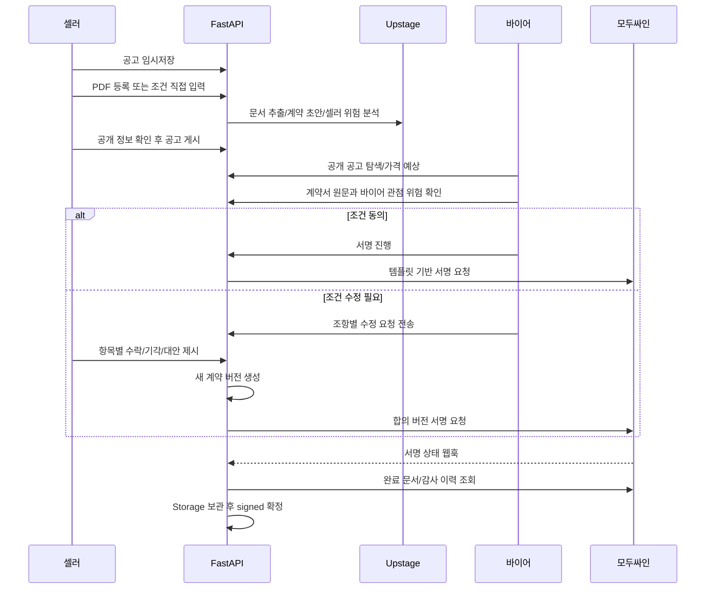
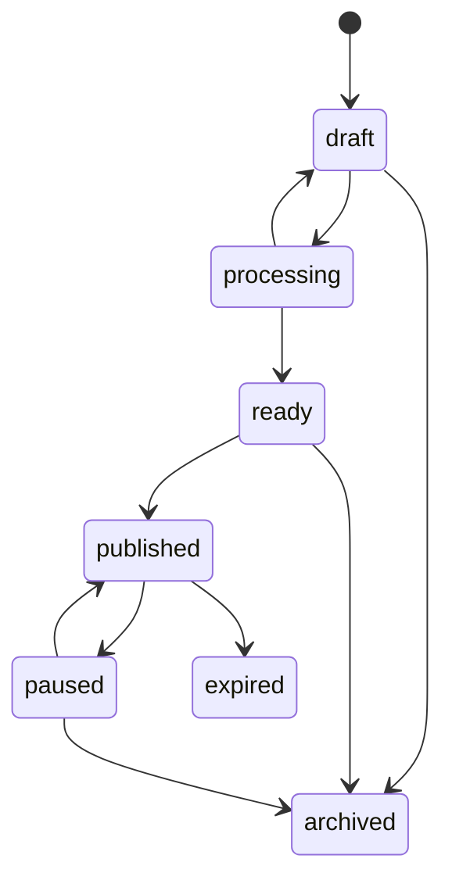
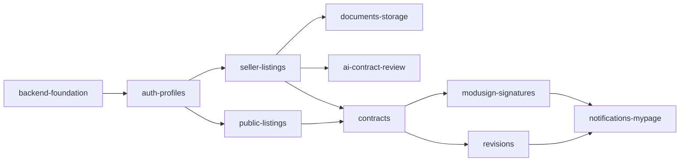

> 버전: Figma·backend aligned MVP v1.5
>
> 구현 기준: 현재 작업 브랜치의 router/schema와 migration `001`~`011`
> 
> 
> 백엔드: FastAPI 단일 애플리케이션
> 
> 데이터: Supabase Auth + PostgreSQL + Storage
> 
> AI/RAG: Upstage Document Parse, Information Extract(구현 adapter: Universal Extraction), Files, Vector Store, File Search, Solar Pro 3 단일 계약검토 Agent + 고정 task 함수
> 
> 전자서명: 모두싸인 템플릿 기반 API
> 

AI task, prompt, rule engine과 Upstage 연동은 `AI_UPSTAGE_ARCHITECTURE.md`, RAG 파일·검색·인용은 `RAG_KNOWLEDGE_BASE.md`를 따른다.

### 문서 읽는 법

이 문서는 현재 구현과 목표 설계를 함께 관리한다. 아래 **현재 구현 API**에 있는 endpoint만 `main`에서 호출할 수 있으며, 나머지는 `[계획]`으로 적은 목표 명세다. 문서의 예시만 보고 router에 없는 endpoint를 구현 완료로 판단하지 않는다.

현재 구현 API:

- health: `GET /health/live`, `GET /health/ready`
- auth: `POST /api/v1/auth/signup`, `POST /api/v1/auth/login`, `POST /api/v1/auth/demo-login`, `POST /api/v1/auth/logout`, `POST /api/v1/auth/password/reset-email`, `PATCH /api/v1/auth/password`
- profile: `GET /api/v1/me`, `PATCH /api/v1/me`, `GET /api/v1/organizations/{id}`, `PATCH /api/v1/organizations/{id}`
- public listing: `GET /api/v1/public/listings`, `GET /api/v1/public/listings/{id}`, `GET /api/v1/public/listings/{id}/contract-preview`, `POST /api/v1/public/listings/{id}/price-estimates`
- contract: `POST /api/v1/listings/{id}/contract-requests`, `GET /api/v1/contracts/{id}`, `GET /api/v1/me/contracts`, `GET /api/v1/seller/contracts/received`, `GET /api/v1/seller/dashboard`, `POST /api/v1/contracts/{id}/cancel`

`POST /api/v1/auth/signup`, `POST /api/v1/auth/login`, `POST /api/v1/auth/demo-login`,
`POST /api/v1/auth/logout`, `POST /api/v1/auth/password/reset-email`,
`PATCH /api/v1/auth/password`를 제공한다. 세션과 비밀번호는 Supabase Auth가 관리하고
애플리케이션 DB에는 저장하지 않는다.

## 1. 제품 모델과 설계 결정

Busan Link는 부산 관광 셀러가 계약 가능한 관광상품 공고를 공개하고, 외국인 개인 바이어가 계약서를 검토한 뒤 직접 서명하거나 조항 수정을 요청하는 관광 계약 플랫폼이다.

이번 와이어프레임을 반영해 `공고(listing)`와 `계약(contract)`을 분리한다.

- `listing`: 셀러가 공개한 계약 가능한 상품과 표준 계약 조건. 여러 바이어가 탐색할 수 있다.
- `contract`: 특정 외국인 개인 바이어가 listing을 선택한 순간 생성되는 셀러 업체와 개인 간 계약 건. 협상·버전·서명 이력을 가진다.
- 단체 여행이어도 buyer는 개인 사용자다. 선택적인 단체명과 인원수를 계약 당시 snapshot으로 저장한다.
- MVP의 단체서명은 참가자 전원의 다중 서명이 아니라, 대표자 1명이 단체를 대표해 서명하는 방식이다.
- listing이 수정되어도 이미 생성된 contract의 본문은 바뀌지 않는다. contract 생성 시 listing의 현재 버전을 snapshot한다.
- 로그인하지 않은 사용자의 기본 화면은 공개 바이어 탐색 화면이다.
- 셀러는 가입할 수 있지만 검증 완료 전에는 공고를 공개할 수 없다.
- 비밀번호는 Supabase Auth만 처리하고 애플리케이션 DB에는 절대 저장하지 않는다.
- 상품 카테고리는 `vehicle_rental`, `activity`, `tour`, `accommodation` 네 가지로 통일한다.
- 지원 언어는 `ko-KR`, `en-US`, `ja-JP`, `zh-CN` 네 가지로 통일한다.
- FastAPI가 전체 workflow와 상태 전이를 결정적으로 통제한다. Solar 기반 Agent는 `contract_review`에만 사용하고, 파싱·추출·초안 생성·요약·번역·가격 계산·전자서명은 자율 Agent로 만들지 않는다.
- 계약검토 Agent가 호출할 수 있는 도구는 `get_clause_context`, `search_official_evidence`, `search_approved_templates`, `submit_review`로 제한하며 최대 검색 반복 횟수는 2회다.

수정 요청 화면은 **12-2 항목별 판단 방식**을 기본으로 한다. 조항마다 수락·기각·대안 제시가 가능해 감사 이력과 계약 버전 생성이 명확하기 때문이다. `계약 안하기`는 전체 협상 종료, `전체 거절`은 편의 기능으로 별도 제공한다.



### 1.1 Figma 화면과 백엔드 정렬 원칙

- 화면의 상품명도 백엔드 기준인 자동차 렌탈(`vehicle_rental`), 액티비티(`activity`), 투어(`tour`), 숙박(`accommodation`)을 사용한다.
- 화면의 한글 상태명은 표시용이며 API 요청·응답과 DB에는 백엔드 상태값을 그대로 사용한다.
- `응답 도착`은 계약 상태가 아니다. 상대방의 새 답변이 있고 아직 읽지 않았다는 알림 badge로 계산한다.
- 로그인 화면에서 사용자가 buyer/seller를 선택해 권한을 정하지 않는다. 로그인 성공 후 `GET /me`가 반환한 역할로 이동한다. 역할 선택형 빠른 로그인은 개발·데모 환경에서만 제공한다.
- 셀러의 별도 `계약 가능` boolean은 만들지 않는다. 공고가 `published`이면 계약 가능, `paused`이면 공개 목록에는 보이지만 신규 계약 요청은 불가능하다.
- AI 위험 항목의 공개 여부는 셀러가 임의로 켜고 끄지 않는다. 공개 API는 시스템이 승인한 buyer 관점 finding만 반환하고 seller 내부 finding은 항상 제외한다.

새 컬럼이나 테이블이 필요한 항목은 DB 명세에 목표 구조로 표시한다. 기존 migration은 수정하지 않으며 실제 구현 브랜치에서 새 migration을 추가한다.

### 1.2 특별상 요구사항 충족표

| 과제 요구기능 | 구현 기준 | 핵심 API/저장 |
| --- | --- | --- |
| 계약 파싱·구조화 | Document Parse 후 Information Extract로 요금·기간·취소·환불·안전·보상·책임 추출 | `POST /documents/{id}/complete`, `documents.extracted_data` |
| 리스크 점검·경고 | 규칙 엔진과 단일 `ContractReviewAgent`가 필요할 때 공식 PDF 근거를 검색하고 누락/불리 조항과 원문 위치를 반환 | `POST /seller/listings/{id}/analyses`, `ai_analysis_runs`, `rag_retrieval_runs`, `ai_findings` |
| 표준 안전장치 | 공식/승인 템플릿 RAG로 대안 문구를 만들고 사용자가 적용해야 새 version 생성 | `POST /ai-findings/{id}/apply` |
| 4개 언어 | 한국어·영어·일본어·중국어 요약/설명 cache, 숫자·날짜 보존 검증 | `locale`, `localized_contents` |
| 전자서명·증빙 | 요청→서명→웹훅→상태 처리→완료본/audit trail 보관 | signature API, `POST /webhooks/modusign` |

## 2. 공통 규약

### Base URL과 인증

```
/api/v1
Authorization: Bearer <supabase_access_token>
X-Organization-Id: <seller-organization-uuid>
Content-Type: application/json
```

업무 API는 `/api/v1` 아래에 둔다. 현재 인증 없이 호출할 수 있는 경로는
`/api/v1/public/**`, `/api/v1/auth/signup`, `/api/v1/auth/login`, `/health/**`다.
로그아웃과 비밀번호 변경을 포함한 그 외 구현 API는 Supabase access token이 필요하다.
`/health/**`는 `/api/v1` prefix 밖에 있다. `X-Organization-Id`는 셀러 조직 API에서만
사용하며, 바이어 API의 권한은 로그인한 `auth.uid()`를 기준으로 확인한다.

FastAPI는 토큰을 검증한 뒤 바이어 계약은 `contracts.buyer_user_id`, 셀러 기능은 `organization_members`를 확인한다. service role이 RLS를 우회하므로 토큰 검증만으로 권한 검사를 끝내면 안 된다.

### 응답 형식

```json
{
  "data": {},
  "meta": { "request_id": "01J..." }
}
```

목록:

```json
{
  "data": [],
  "meta": {
    "request_id": "01J...",
    "next_cursor": null,
    "has_more": false
  }
}
```

오류:

```json
{
  "error": {
    "code": "LISTING_NOT_PUBLISHABLE",
    "message": "필수 공개 정보가 부족합니다.",
    "details": { "missing_fields": ["cancellation_policy"] },
    "request_id": "01J..."
  }
}
```

금액은 정수 `amount_minor`로 주고받는다. KRW 145,000원은 `145000`이다. 모든 timestamp는 UTC ISO 8601이다.

지원 locale은 `ko-KR|en-US|ja-JP|zh-CN`만 허용한다. 원 계약서와 공식 RAG 검색의 canonical 언어는 한국어이며, 확정된 요약·finding·대안 문구를 선택 locale로 변환한다.

### 주요 오류 코드

| HTTP | 코드 | 의미 |
| --- | --- | --- |
| 400 | `VALIDATION_ERROR`, `ORGANIZATION_HEADER_REQUIRED` | 입력/업무 규칙 또는 조직 header 오류 |
| 401 | `AUTH_REQUIRED`, `TOKEN_INVALID` | 인증 실패 |
| 403 | `ORG_ACCESS_DENIED`, `SELLER_NOT_VERIFIED` | 조직 권한 또는 셀러 검증 문제 |
| 404 | `PROFILE_NOT_FOUND`, `ORGANIZATION_NOT_FOUND`, `LISTING_NOT_FOUND`, `CONTRACT_NOT_FOUND` | 리소스 없음 또는 비공개 |
| 409 | `USERNAME_CONFLICT`, `VERSION_CONFLICT`, `INVALID_STATE_TRANSITION` | 고유값·동시 수정 또는 상태 전이 충돌 |
| 410 | `LISTING_EXPIRED` | 공고 또는 공급 기간 만료 |
| 422 | `LISTING_NOT_PUBLISHABLE`, `AI_INPUT_INSUFFICIENT` | 필수 공개/AI 입력 부족 |
| 429 | `RATE_LIMITED` | API/AI 호출 제한 |
| 502 | `AI_PROVIDER_ERROR`, `SIGN_PROVIDER_ERROR` | 외부 제공자 실패 |
| 503 | `AUTH_PROVIDER_UNAVAILABLE`, `DATABASE_UNAVAILABLE` | 인증 제공자 또는 DB 연결 실패 |

비용이나 외부 부작용이 있는 POST에는 `Idempotency-Key`를 사용한다.

## 3. 상태 모델

### 공고 상태



| 상태 | 의미 |
| --- | --- |
| `draft` | 필수값 미완성도 허용하는 임시저장 |
| `processing` | OCR, 계약 생성 또는 AI 분석 중 |
| `ready` | 계약 본문 작성 완료, 공개 카드 확인 단계 |
| `published` | 비로그인 사용자에게 공개 |
| `paused` | 신규 계약 요청 일시 중지 |
| `expired` | 공급 가능 기간 종료 |
| `archived` | 셀러가 보관 처리 |

| API/DB 값 | Figma 화면 표시 |
| --- | --- |
| `draft` | 임시저장 |
| `processing` | 처리 중 |
| `ready` | 게시 준비 |
| `published` | 공개 중 |
| `paused` | 공개 중지 |
| `expired` | 기간 만료 |
| `archived` | 보관 |

### 실제 계약 상태

| 상태 | 화면 버킷 |
| --- | --- |
| `draft` | 바이어의 작성 중인 계약 요청 |
| `seller_review` | 셀러 협상 요청/검토 대기 |
| `revision_requested` | 수정 요청 진행 중 |
| `signing` | 서명 대기 |
| `signed` | 서명한 계약/체결된 계약 |
| `cancelled` | 협상 종료/계약 안하기 |

Figma의 `셀러 검토 중`은 `seller_review`, `협상 중`은 `revision_requested`, `서명 대기`는 `signing`, `체결 완료`는 `signed`, `종료`는 `cancelled`로 표시한다. `응답 도착`은 unread 알림 여부이므로 새 계약 상태로 추가하지 않는다.

`이미 끝난 계약`, `계약 기간 만료`는 별도 DB 상태를 강제로 만들기보다 `signed`이면서 `contract_terms.service_end_date < today`인 계약을 계산해 반환한다.

### 수정 요청 상태

`draft → sent → accepted | rejected | partially_accepted | countered | cancelled`

항목 상태는 `pending | accepted | rejected | countered`다. 모든 항목 결정 전에는 `다음으로`가 활성화되지 않는다.

## 4. 화면별 API 매핑

아래 경로에는 공통으로 `/api/v1`이 붙는다. `구현`은 현재 `main`의 router와 schema로 확인한 상태이고, `계획`은 목표 명세다.

| 화면 | 핵심 API | 상태 |
| --- | --- | --- |
| 비로그인 바이어 탐색 | `GET /public/listings` | 구현 |
| 로그인/가입 | `POST /auth/signup`, `POST /auth/login`, `POST /auth/demo-login`, `POST /auth/logout`, `POST /auth/password/reset-email`, `PATCH /auth/password` | 구현 |
| 로그인 후 역할 확인 | `GET /me` | 구현 |
| 바이어 공고 상세 | `GET /public/listings/{id}` | 구현 |
| 계약서 원문/AI 비서 | `GET /public/listings/{id}/contract-preview` | 구현 |
| 예상 가격 | `POST /public/listings/{id}/price-estimates` | 구현 |
| 바이어 계약 요청 | `POST /listings/{id}/contract-requests` | 구현 |
| 바이어 수정 요청 | `POST /contracts/{id}/revision-requests` | 구현 |
| 바이어 서명 | `POST /contracts/{id}/signature-requests` | 계획 |
| 바이어 마이페이지 | `GET /me`, `GET /me/contracts` | 구현 |
| 셀러 기본 화면 | `GET /seller/dashboard` | 구현 |
| 셀러가 받은 계약 요청 | `GET /seller/contracts/received` | 구현 |
| 내 공고문·편집 | `GET /seller/listings`, `GET /seller/listings/{id}` | 구현 |
| 직접 작성 | `POST /seller/listings`, `PATCH /seller/listings/{id}/terms` | 구현 |
| AI 계약 생성 | `POST /seller/listings/{id}/generate` | 계획 |
| 문서 업로드·검증 | `POST /documents/upload-url`, `POST /documents/{id}/complete`, `GET /documents/{id}`, `POST /documents/{id}/download-url` | 구현 |
| 작성 완료·게시 | `POST /seller/listings/{id}/complete`, `PATCH /seller/listings/{id}/presentation`, `POST /seller/listings/{id}/publish`, `POST /seller/listings/{id}/pause`, `POST /seller/listings/{id}/archive` | 구현 |
| 수정 요청 알림·판단 | revision request API와 알림 생성 | 구현 |
| 계약 상세·취소 | `GET /contracts/{id}`, `POST /contracts/{id}/cancel` | 구현 |
| 계약 버전·비교 | `GET /contracts/{id}/versions`, `GET /contracts/{id}/versions/compare` | 구현 |
| 서명 전 최종 승인 | `POST /contracts/{id}/versions/{version_id}/approve`, `GET /contracts/{id}/versions/{version_id}/approvals` | 구현 |
| 셀러 마이페이지 | `GET /me`, `PATCH /me`, `GET/PATCH /organizations/{id}` | 구현 |
| 알림·계약 이력 | `GET/PATCH /notifications`, `GET /contracts/{id}/audit-events` | 구현 |

## 5. 인증·가입·프로필

### `[구현] POST /auth/signup`

바이어 예시:

```json
{
  "role": "buyer",
  "email": "buyer@globaltrip.jp",
  "password": "<submitted-over-tls>",
  "password_confirmation": "<submitted-over-tls>",
  "username": "globaltrip_aiko",
  "display_name": "Tanaka Aiko",
  "phone": "+81-90-0000-0000",
  "country_code": "JP",
  "locale": "ja-JP",
  "affiliation_name": "GlobalTrip Japan",
  "business_type": "inbound_travel",
  "default_group_name": "부산 여름여행 모임",
  "preferred_currency": "JPY"
}
```

셀러 예시:

```json
{
  "role": "seller",
  "email": "sales@oceanstay.kr",
  "password": "<submitted-over-tls>",
  "password_confirmation": "<submitted-over-tls>",
  "username": "oceanstay",
  "display_name": "김부산",
  "phone": "+82-10-0000-0000",
  "organization_name": "해운대 오션스테이",
  "legal_name": "오션스테이 주식회사",
  "representative_name": "김대표",
  "business_registration_no": "<registration-number>",
  "business_address": "부산광역시 해운대구 ...",
  "supply_categories": ["accommodation"],
  "job_title": "계약 담당자"
}
```

처리 규칙:

- FastAPI가 Supabase Auth 사용자를 생성한 뒤 바이어는 profile만, 셀러는 profile·organization·membership을 보상 가능한 흐름으로 만든다.
- password는 Supabase Auth에만 전달하고 DB·로그·감사 이벤트에 저장하지 않는다.
- 바이어는 개인 profile만 생성하며 buyer organization을 자동 생성하지 않는다.
- `default_group_name`은 선택 항목이며 법인·단체 계정이나 별도 계약 당사자를 의미하지 않는다.
- `affiliation_name`과 `business_type`도 선택 정보다. 개인 바이어의 소속·활동 맥락을 표시할 뿐 계약 당사자를 조직으로 바꾸지 않는다.
- 셀러 organization은 `pending`으로 생성된다. draft 작성은 가능하지만 `verified` 전에는 publish할 수 없다.
- Figma에서 고른 사업자등록증 파일은 가입 성공 후 발급된 organization id로 인증된 upload URL을 받아 업로드한다. 가입 전 임시 공개 업로드나 base64 파일을 signup JSON에 넣지 않는다.
- `username`은 표시/검색용 별칭이다. MVP 로그인 식별자는 이메일을 사용한다.

응답의 `email_confirmation_required`가 `true`이면 Supabase 프로젝트의 이메일 확인
링크/OTP를 완료한 뒤 로그인한다. 이메일 확인 방식과 템플릿은 Supabase Auth 설정이
결정하며 애플리케이션 DB에 인증번호를 저장하지 않는다.

### `[구현] POST /auth/login`

```json
{ "email": "buyer@globaltrip.jp", "password": "<password>" }
```

Supabase access token, refresh token과 만료 정보를 반환한다. 현재 구현은 FastAPI가
Supabase Auth REST API를 호출하는 방식으로 통일한다.

운영 로그인 request에는 `role`을 받지 않는다. 인증 후 프론트는 `GET /me`의 `role`을 확인해 buyer 또는 seller 화면으로 이동한다. Figma의 buyer/seller 데모 버튼은 고정 demo account를 쓰는 개발 환경 기능으로 분리한다.

### `[구현] POST /auth/demo-login`

```json
{ "role": "buyer" }
```

`DEMO_LOGIN_ENABLED=true`인 환경에서만 동작한다. 바이어·셀러 데모 계정의 이메일과
비밀번호는 서버 환경변수에서 읽으며 응답이나 소스 코드에 노출하지 않는다. 운영 환경은
기본값인 `false`를 유지한다.

### `[구현] POST /auth/logout`

Bearer access token을 검증한 뒤 Supabase 세션을 폐기한다.

### `[구현] PATCH /auth/password`

비밀번호 복구 링크로 돌아와 발급받은 Supabase recovery session을 Bearer token으로 보내고,
다음 body로 새 비밀번호를 저장한다. 비밀번호는 애플리케이션 DB에 저장하지 않는다.

```json
{
  "new_password": "<submitted-over-tls>",
  "new_password_confirmation": "<submitted-over-tls>"
}
```

### `[구현] POST /auth/password/reset-email`

로그인 사용자의 이메일로 Supabase 비밀번호 복구 메일을 보낸다. 마이페이지의
`비밀번호 변경` 버튼은 이 API를 호출한다. 메일 링크는
`AUTH_PASSWORD_RESET_REDIRECT_URL`로 이동하며, 프론트가 recovery session을 만든 뒤
`PATCH /auth/password`를 호출한다.

### `[구현] GET /me` / `PATCH /me`

이름, username, 전화번호, 이메일, 나라/언어, 선호 통화, 선택적 소속명·업종·기본 단체명, 가입일과 역할을 반환/수정한다. 셀러에게만 소속 organization과 검증 상태를 함께 반환한다. 이메일과 비밀번호 변경은 Supabase Auth 전용 흐름을 사용한다.

`PATCH /me`는 다음 필드만 부분 수정할 수 있다.

```json
{
  "username": "globaltrip_aiko",
  "display_name": "Tanaka Aiko",
  "phone": "+81-90-0000-0000",
  "country_code": "JP",
  "locale": "ja-JP",
  "preferred_currency": "JPY",
  "affiliation_name": "GlobalTrip Japan",
  "business_type": "inbound_travel",
  "default_group_name": "부산 여름여행 모임"
}
```

`id`, `email`, `role`, 비밀번호 및 organization 관련 필드는 이 요청으로 변경할 수 없다. `username`은 대소문자를 구분하지 않고 unique이며 충돌 시 `USERNAME_CONFLICT`를 반환한다. profile 조회와 수정 대상은 항상 검증된 access token의 `sub = auth.users.id`다.

### `[구현] GET /me/contracts?bucket=draft|seller_review|revision_requested|signing|signed|cancelled|finished`

바이어가 보낸 계약 요청과 진행 상태를 확인하는 목록이다. 각 항목은 화면에서 바로 사용할
`bucket`, 쉬운 한국어 `status_label`, 셀러명, 계약 기간과 예상 금액을 반환한다.
`finished`는 서비스 기간이 끝난 signed 계약을 계산해 반환한다. 취소 건은 `cancelled`이며,
`has_unread_response=true`이면 Figma에서 `응답 도착` badge를 함께 표시한다. 응답 도착은
알림 여부일 뿐 새로운 contract status가 아니다.

## 6. 공개 바이어 탐색

### `[구현] GET /public/listings`

Query:

- `q=오션스테이` 제목·업체명 검색
- `contract_available_only=true|false` 계약 요청 가능한 `published` 공고만 조회할지 여부
- `sort=recommended|popular|latest|price_asc|price_desc`
- `district=해운대구` 복수 가능
- `people=30`
- `min_price`, `max_price`, `currency`
- `category=vehicle_rental|activity|tour|accommodation`
- `start_date`, `end_date`
- `locale=ko-KR|en-US|ja-JP|zh-CN`
- `cursor`, `limit`

공급 기간이 지나지 않은 `published`와 `paused` 공고를 반환한다. `paused`는 Figma에서 목록·상세를 계속 볼 수 있지만 `contract_available=false`이며 계약 요청 버튼을 비활성화한다. `draft`, `processing`, `ready`, `expired`, `archived`는 공개 API에서 반환하지 않는다.

```json
{
  "data": [
    {
      "id": "uuid",
      "seller": {
        "name": "해운대 오션스테이",
        "rating": 4.8,
        "rating_count": 24,
        "verified": true
      },
      "title": "2026 부산 여름 객실 공급",
      "district": "해운대구",
      "category": "accommodation",
      "hero_image_url": "https://...signed...",
      "ai_summary": "7~8월 주말 단체를 위한 해운대 객실 공급 계약입니다.",
      "base_price": {
        "amount_minor": 145000,
        "currency": "KRW",
        "unit": "room_night"
      },
      "availability": { "start_date": "2026-07-01", "end_date": "2026-08-31" },
      "status": "published",
      "contract_available": true,
      "attention_required_count": 2
    }
  ]
}
```

`recommended`는 MVP에서 검증 여부, 공급 가능 여부, 정보 완성도, 인기도를 가중 합산한 deterministic score로 구현한다. 근거 없는 LLM 추천 순위를 만들지 않는다.

목록 card에는 계산 입력이 없으므로 예상 합계를 포함하지 않는다. 예상 금액은 아래 `price-estimates` endpoint로 계산한다. `attention_required_count`는 최신 성공 buyer 분석의 미기각 finding이 연결된 서로 다른 조항 수다.

### `[구현] POST /public/listings/{listing_id}/price-estimates`

```json
{
  "people": 30,
  "quantity": 15,
  "quantity_unit": "room",
  "nights": 2,
  "start_date": "2026-07-11",
  "end_date": "2026-07-13",
  "currency": "JPY"
}
```

`people`은 단체 규모이고 실제 과금 수량은 `quantity`와 `quantity_unit`으로 명시한다. 예를 들어 30명이 2인실 15개를 2박 이용하면 `people=30`, `quantity=15`, `quantity_unit=room`, `nights=2`다. 서버가 임의로 객실당 2명을 가정하지 않는다.

```json
{
  "data": {
    "base_unit_price_amount_minor": 145000,
    "billing_quantity": 15,
    "quantity_unit": "room",
    "nights": 2,
    "start_date": "2026-07-11",
    "end_date": "2026-07-13",
    "formula": "145000 KRW × 15 room × 2 nights × 0.11 JPY/KRW",
    "total_estimated_amount_minor": 478500,
    "base_currency": "KRW",
    "display_currency": "JPY",
    "exchange_rate": "0.11",
    "exchange_rate_as_of": "2026-07-31T00:00:00Z",
    "disclaimer": "This is an estimated price based on the current listing terms and exchange rate. The final contract price may differ."
  },
  "meta": { "request_id": "01J..." }
}
```

응답은 예상 금액, 계산식, 사용한 수량·단위·단가·기간, 환율 기준 시각과 고지를 포함한다. 현재 schema에는 `confidence`나 AI 설명 필드가 없다. 공개 화면의 반복 계산은 DB에 행을 만들지 않는 stateless preview다. 바이어가 계약 요청을 생성할 때 서버가 같은 규칙으로 다시 계산해 입력·금액·환율·계산식을 contract snapshot에 저장한다. AI는 계산이 아니라 설명만 담당한다.

주요 오류는 과금 수량·단위 불일치 `400 INVALID_BILLING_QUANTITY|UNSUPPORTED_QUANTITY_UNIT`, 기간 범위 초과 `400 SERVICE_PERIOD_OUT_OF_RANGE`, 비공개 상태 `409 LISTING_NOT_PRICEABLE`, 만료 `410 LISTING_EXPIRED`, 가격 조건 부족 `422 PRICE_TERMS_INCOMPLETE|UNSUPPORTED_PRICE_UNIT`, 환율 제공자 장애 `503 EXCHANGE_RATE_UNAVAILABLE`다.

### `[구현] GET /public/listings/{listing_id}`

계약명, 셀러, 지역, 평점, 공고 상태, 계산된 계약 가능 여부, 셀러가 입력한 `public_headline`, 공급 수량 문구, 최소·최대 공급 수량, 단위당 인원, 기준 단가, 최소·최대 인원, 공급 기간과 조항을 반환한다. 정책 필드는 `cancellation_policy`, `no_show_policy`, `refund_policy`, `settlement_policy`, `safety_policy`, `compensation_policy`, `liability_policy`, `termination_policy`, `special_terms`, `price_display_basis`, `contract_availability_note`다. 현재 canonical source가 없는 `vat_included`만 항상 `null`이다. 별도 `contract_available` 컬럼을 저장하지 않고 `status == published`인지 계산한다.

### `[구현] GET /public/listings/{listing_id}/contract-preview`

공개용 계약 본문, 조항별 anchor, 바이어 관점 AI finding을 반환한다. 셀러 내부 검토용 finding과 원본 파일의 비공개 metadata는 제외한다.

```json
{
  "data": {
    "listing_version_id": "uuid",
    "clauses": [
      {
        "id": "uuid",
        "clause_key": "cancellation",
        "title": "제3조 취소 및 변경",
        "body": "최종 수량과 취소 수수료는 협상 후 확정됩니다.",
        "highlight": "warning"
      }
    ],
    "findings": [
      {
        "clause_id": "uuid",
        "severity": "medium",
        "explanation": "취소 수수료 확정 시점이 모호해 분쟁 가능성이 있습니다.",
        "suggested_text": "체크인 7일 전까지 무료 취소로 명시하는 방안을 확인해 보세요.",
        "disclaimer": "법률 자문이 아닌 계약 검토 보조 의견입니다."
      }
    ]
  }
}
```

응답에는 요청 `locale`, 원문 `content_locale`, 번역이 없을 때 사용한 `fallback_locale`도 포함한다. 공개되는 finding은 buyer 관점으로 승인된 결과뿐이며 셀러가 개별 항목을 숨김 처리하는 API는 제공하지 않는다.

## 7. 셀러 공고 작성·등록·공개

이 절에서 현재 구현된 endpoint는 `GET /seller/dashboard`뿐이다. 나머지 seller listing·document·AI endpoint는 목표 명세다.

### `[구현] GET /seller/dashboard`

셀러 첫 화면에 필요한 숫자와 최근 요청을 한 번에 반환한다. 공개 중인 공고 수, 받은 요청 수,
상태별 계약 수, 최근 계약 요청 최대 5건과 공고별 요청 수를 포함한다. 현재 query parameter는 없으며 `X-Organization-Id`가 필요하다.

```json
{
  "data": {
    "stats": {
      "published_listings": 3,
      "received_requests": 8,
      "seller_review": 2,
      "revision_requested": 1,
      "signing": 1,
      "signed": 3,
      "cancelled": 1
    },
    "recent_requests": [],
    "listing_request_counts": [
      {
        "listing_id": "uuid",
        "listing_title": "2026 부산 여름 객실 공급",
        "listing_status": "published",
        "request_count": 4
      }
    ]
  },
  "meta": { "request_id": "01J..." }
}
```

### `[구현] GET /seller/listings`

셀러 조직이 소유한 draft/processing/ready/published/paused/expired/archived 공고를 반환한다. `X-Organization-Id`와 organization membership을 확인하며 각 공고에는 기간, 공급 수량 문구, 기준 단가, 공개용 한 줄 소개, 계산된 계약 가능 여부, 최신 셀러 분석의 확인 필요 조항 수, 현재 version 번호, 요청 수와 작성 완료에 부족한 `missing_fields`가 포함된다.

### `[구현] GET /seller/listings/{listing_id}`

Figma의 공고 편집·상세 화면에 필요한 현재 terms, presentation, current immutable version과 clauses, 작성 완료 누락 항목을 반환한다. URL의 공고가 `X-Organization-Id` 조직 소유인지 먼저 확인한다. AI 처리는 후속 범위이므로 현재 `processing_job`은 `null`이다.

### `[구현] POST /seller/listings`

```json
{
  "creation_method": "manual",
  "title": "2026 부산 여름 객실 공급",
  "category": "accommodation",
  "district": "해운대구",
  "language": "ko-KR"
}
```

`creation_method`는 `manual|upload`다. 항상 `draft`로 생성하고 빈 immutable listing version V1과 현재 terms 행을 함께 만든다. `Idempotency-Key`가 필수이며 같은 key와 같은 요청은 최초 생성 결과를 반환한다.

### `[구현] PATCH /seller/listings/{listing_id}/terms`

임시저장용 부분 수정 endpoint다. 필수값이 덜 입력되어도 저장된다.

```json
{
  "base_version_no": 1,
  "terms": {
    "service_start_date": "2026-07-01",
    "service_end_date": "2026-08-31",
    "supply_quantity": 30,
    "supply_quantity_description": "주말 객실 최대 30실",
    "quantity_unit": "room",
    "minimum_quantity": 10,
    "maximum_quantity": 30,
    "people_per_unit": 2,
    "base_price_amount_minor": 145000,
    "currency": "KRW",
    "price_unit": "room_night",
    "minimum_people": 20,
    "cancellation_policy": "체크인 7일 전까지 무료 취소",
    "no_show_policy": "사전 연락 없는 당일 미이용은 환불 불가",
    "refund_policy": "취소 시점에 따른 환불액을 원 결제수단으로 반환",
    "settlement_policy": "월 마감 후 15일 이내",
    "safety_policy": "시설 안전점검과 긴급 연락체계를 제공",
    "compensation_policy": "셀러 귀책으로 이용 불가 시 대체 서비스 또는 환불",
    "liability_policy": "고의 또는 과실에 따른 당사자별 책임 범위를 명시",
    "termination_policy": "중대한 계약 위반 시 서면 통지 후 해지",
    "special_terms": "단체 인원은 체크인 14일 전 확정"
  }
}
```

부분 입력을 현재 terms와 합쳐 저장하며 기간, 최소·최대 공급 수량, 최소·최대 인원 범위를 검사한다. `supply_quantity_description`은 프론트의 “주말 객실 최대 30실” 같은 자유형 문구를 손실 없이 보존하고, `minimum_quantity`/`maximum_quantity`는 실제 과금 수량 범위다. 저장할 때 기존 version을 수정하지 않고 구조화 terms snapshot, 계약 정책 clauses와 본문을 가진 V2, V3 등의 새 version을 만든다. 현재 version 번호가 `base_version_no`와 다르면 `VERSION_CONFLICT`다. 계약 요청이 하나라도 존재하면 가격·기간·정책을 포함한 terms 변경을 `LISTING_HAS_CONTRACTS`로 차단한다. 이미 공개 또는 중지된 공고는 필수값을 제거하는 수정도 허용하지 않는다.

### PDF 등록 흐름

1. `POST /documents/upload-url`에 `listing_id`, 파일 metadata, `purpose=source_contract` 전달
2. 브라우저가 Supabase Storage signed URL로 직접 업로드
3. `POST /documents/{document_id}/complete`
4. Upstage Document Parse → Information Extract
5. listing terms/version/clauses 후보 생성
6. 규칙 엔진 실행 후 단일 `ContractReviewAgent`가 필요한 근거만 공식/템플릿 Vector Store에서 File Search
7. `GET /ai-jobs/{job_id}` polling

`GET /ai-jobs/{job_id}`는 인증된 바이어 본인 또는 `X-Organization-Id`로 확인된 셀러
조직 구성원만 조회할 수 있다. 응답은 provider 원문이나 계약 내용을 포함하지 않고 다음
비민감 진행 정보만 반환한다.

```json
{
  "data": {
    "id": "uuid",
    "task_type": "document_parse",
    "status": "processing",
    "progress": 35,
    "result_resource_type": null,
    "result_resource_id": null,
    "failure_code": null,
    "created_at": "2026-08-01T12:00:00Z",
    "started_at": "2026-08-01T12:00:01Z",
    "completed_at": null
  },
  "meta": {"request_id": "..."}
}
```

상태는 DB enum과 동일하게 `queued → processing → succeeded` 또는 `failed`를 사용한다.
동일 immutable target, task, prompt, model, viewer role은 결정적 idempotency key로 중복 실행을
막는다.

사용자 계약서 원문은 공용 Vector Store에 올리지 않는다. Upstage Files/Vector Store는 별도로 검수한 공식 근거와 승인 템플릿에만 사용한다.

문서 저장 브랜치에서 `complete`는 Storage object를 streaming으로 읽어 파일 signature,
크기와 SHA-256을 검증하고 `documents.status=uploaded`까지만 변경한다. Document Parse와
Information Extract job 생성은 후속 AI 처리 API에서 명시적으로 시작한다.

`POST /documents/upload-url` 요청은 `organization_id`, `listing_id`, `contract_id` 중 정확히
하나와 `purpose`, `original_filename`, `mime_type`, `size_bytes`, `content_sha256`를 받는다.
지원 형식은 PDF, DOCX, JPG/JPEG, PNG이고 기본 최대 크기는 20 MiB다. seller 소유 파일은
`X-Organization-Id`, 모든 upload URL 요청은 `Idempotency-Key`가 필요하다.

네 document API의 응답은 실제 Storage bucket과 object path를 반환하지 않는다. upload URL은
Supabase Storage의 provider 고정 유효시간을 따르고, download URL은 기본 5분 동안 유효하다.

공식 RAG 자료는 MVP에서 PDF를 Markdown으로 변환하지 않고 그대로 Upstage Files API에 업로드한다. 텍스트가 없는 스캔 PDF만 Document Parse/OCR을 거친 검색 가능한 PDF 또는 parse artifact를 사용한다. 국내여행 표준약관은 물리적으로 `common` corpus에 한 번만 저장하되 `contract_categories=["tour"]`로 제한한다.

과제/API 명세에서는 이 단계를 `Information Extract`로 부른다. 실제 Upstage SDK 또는 콘솔에서 기능명이 `Universal Extraction`이면 provider adapter 내부에서만 해당 이름을 사용한다. 외부 job type과 domain interface는 `information_extract`로 유지한다.

Information Extract의 필수 top-level 결과는 다음 일곱 영역이다.

```json
{
  "price": {},
  "service_period": {},
  "cancellation": {},
  "refund": {},
  "safety": {},
  "compensation": {},
  "liability": {}
}
```

각 값은 `value`, `confidence`, `source_page`, `source_quote`, 가능한 경우 `bbox`를 함께 가진다. 필수 영역이 문서에 없으면 값을 만들어내지 않고 `null`과 `missing=true`를 반환해 리스크 분석 입력으로 사용한다.

### `GET /ai-findings/{finding_id}/evidence/{evidence_id}`

AI 패널의 `[1]`, `[2]` 근거 번호를 클릭할 때 호출한다. finding 조회 권한과 evidence 소속을 확인한 후 내부 PDF viewer URL, page/section/bbox, 짧은 excerpt, 공식 원문 URL, 시행일과 조회일을 반환한다. Storage 원본은 private으로 유지하고 짧은 만료시간의 signed URL만 viewer에 제공한다.

### `POST /ai-findings/{finding_id}/apply`

AI가 제안한 표준 안전장치 또는 대안 문구를 사람이 명시적으로 선택했을 때만 호출한다.

```json
{
  "base_version_no": 1,
  "suggested_text_hash": "sha256:...",
  "edited_text": null
}
```

처리 규칙:

1. actor가 해당 listing/contract를 수정할 권한이 있는지 확인한다.
2. finding이 바라보는 version과 `base_version_no`가 같아야 한다.
3. 제안 문구가 분석 당시 값과 같은지 hash로 확인한다.
4. 기존 version을 수정하지 않고 새 version과 clauses를 생성한다.
5. finding을 `applied` 처리하고 audit event를 남긴다.
6. 새 version에 대한 규칙 검사와 역할별 AI 분석을 다시 실행한다.

### `POST /ai-findings/{finding_id}/dismiss`

```json
{ "reason": "현재 계약 운영 방식과 맞지 않아 유지" }
```

finding을 `dismissed`로 표시하되 계약 원문은 변경하지 않는다. 적용과 기각 모두 자동으로 서명 요청을 만들지 않는다.

### `POST /seller/listings/{listing_id}/generate`

직접 입력한 조건으로 고정된 `contract_generate` prompt와 JSON Schema를 사용해 Solar Pro 3가 계약 초안을 생성하고 새 listing version을 만든다. 이 함수는 Agent가 아니며 도구를 자율 호출하지 않는다. 생성 후 셀러 관점 계약검토 Agent를 별도 실행한다.

### `POST /seller/listings/{listing_id}/analyses`

```json
{
  "listing_version_id": "uuid",
  "viewer_role": "seller",
  "analysis_types": ["summary", "risk", "missing_terms"]
}
```

분석 결과는 seller workspace에만 노출한다. 공개 시에는 별도의 `viewer_role=buyer` 분석을 생성한다.

응답 job에는 실행 방식을 명시한다.

```json
{
  "data": {
    "job_id": "uuid",
    "job_type": "risk_analysis",
    "execution_mode": "single_agent",
    "agent_name": "contract_review",
    "max_iterations": 2,
    "status": "queued"
  }
}
```

Agent는 계약을 수정하거나 서명 요청을 만들 수 없다. 최종 출력은 JSON Schema를 통과한 finding 후보뿐이며, 새 version 생성은 사용자가 `apply`를 호출했을 때 domain service가 수행한다.

### `[구현] POST /seller/listings/{listing_id}/complete`

작성 완료 검증 후 `ready`로 변경한다. 프론트 공고 작성 화면과 동일한 최소 필수값:

- 계약명/셀러/상품 유형/부산 구 단위 지역
- 공급 기간/공급 수량 문구(또는 구조화 수량)/기준 가격
- 취소/노쇼/정산 조건
- 현재 listing version과 하나 이상의 조항

책임·계약 해지·특약과 기존 호환 필드인 환불·안전·보상 조건은 구조화해 저장하되 공통 필수로 강제하지 않는다.

필수값이 부족하면 `LISTING_NOT_PUBLISHABLE`과 `details.missing_fields`를 반환한다. 검증에 성공하면 하나의 transaction에서 `draft → processing → ready`로 전환하고 감사 이벤트를 남긴다. 이 단계는 Python 코드로 입력 terms를 조항화하며 AI/OCR provider를 호출하지 않는다.

### `[구현] PATCH /seller/listings/{listing_id}/presentation`

```json
{
  "display_company_name": "해운대 오션스테이",
  "display_title": "2026 부산 여름 객실 공급",
  "hero_document_id": "uuid",
  "seller_description": "일본 단체 관광객을 위한 금연 트윈룸 중심 상품",
  "public_headline": "성수기 주말 객실을 안정적으로 확보하세요.",
  "price_display_basis": "30명·2박 기준",
  "contract_availability_note": "주말 잔여 객실에 따라 확정"
}
```

`hero_document_id`는 해당 공고 소유이며 `purpose=listing_hero`, `status=ready`인 기존 document만 연결할 수 있다. 문서 업로드 API와 AI summary 재생성은 후속 브랜치 범위다.

`public_headline`은 셀러가 직접 입력한 공개용 한 줄 소개이고 `ai_summary`와 분리해 저장한다. 응답의 `contract_available`은 현재 상태로 계산한다. AI 위험 요약 노출은 셀러 토글을 저장하지 않고 승인된 buyer 관점 분석만 서버가 공개한다.

### `[구현] POST /seller/listings/{listing_id}/publish`

셀러 검증 상태와 필수 정보를 확인하고 `ready → published`로 바꾼다. AI 기능이 분리된 현재 manual 공고는 공개용 AI 분석을 필수로 강제하지 않는다. Figma의 `계약 가능` switch를 별도 저장하지 않고 ON은 이 API, OFF는 `POST /seller/listings/{id}/pause`에 연결한다. 중지된 공고의 재개도 별도 `/resume` 없이 이 publish API로 `paused → published` 전이한다.

### `[구현] POST /seller/listings/{listing_id}/pause`

`published → paused`로 전환한다. 이미 paused인 요청은 같은 상태를 반환하며 신규 계약 요청은 public contract API에서 차단된다.

### `[구현] POST /seller/listings/{listing_id}/archive`

`draft|ready|paused → archived`로 전환한다. published 공고는 먼저 pause해야 하며 archived 공고의 terms와 presentation은 더 이상 변경할 수 없다.

## 8. 공고에서 실제 계약 생성

### `[구현] POST /listings/{listing_id}/contract-requests`

인증된 바이어만 호출하며 `Idempotency-Key` header가 필수다. request body는 선언되지 않은 필드를 거절한다.

```json
{
  "people": 30,
  "quantity": 15,
  "quantity_unit": "room",
  "nights": 2,
  "start_date": "2026-07-11",
  "end_date": "2026-07-13",
  "currency": "KRW",
  "group_name": "부산 여름여행 모임",
  "signing_capacity": "group_representative",
  "request_message": "금연 트윈룸 위주 배정을 요청합니다.",
  "initial_request_kind": "revision"
}
```

처리:

- 공개 중인 listing과 공급 조건 확인
- buyer 개인과 seller organization party snapshot 생성
- buyer 이름·국가·이메일, 선택적 단체명, 인원수와 서명 자격을 계약 당시 값으로 보존
- listing current version/clauses를 contract version 1로 복사
- 인원·명시 수량/단위·박수·기간·예상 가격과 계산 근거를 contract terms에 저장
- `initial_request_kind=as_is`이면 `draft → seller_review`
- `initial_request_kind=revision`이면 `draft → revision_requested`
- 같은 사용자와 `Idempotency-Key`의 동일 요청은 기존 계약 생성 결과를 반환하고,
  다른 요청 본문으로 key를 재사용하면 거절

셀러가 같은 version을 승인하면 그때 `signing`으로 전이하고 실제 전자서명 요청을 진행한다. 공고 게시를 seller의 사전 서명으로 간주하지 않는다. 응답은 `contract_id`, `version_no`, 현재 상태를 반환한다.

바이어 이름·이메일·전화번호는 로그인 profile에서 읽어 화면에 표시하며 request로 임의의 계약 당사자를 덮어쓰지 않는다. `paused` 공고는 조회할 수 있지만 이 endpoint는 `INVALID_STATE_TRANSITION`으로 거절한다.

추가 검증 규칙:

- 모든 수량과 `nights`는 1 이상이어야 한다.
- `currency`는 대문자 ISO 4217 세 글자 형식이어야 한다.
- `end_date`는 `start_date`보다 늦어야 하고 두 날짜의 차이는 `nights`와 같아야 한다.
- `signing_capacity=group_representative`이면 `group_name`이 필수다.
- 만료된 공고는 `410 LISTING_EXPIRED`, 공개 중이 아닌 공고는 `409 INVALID_STATE_TRANSITION`이다.

응답:

```json
{
  "data": {
    "contract_id": "uuid",
    "version_no": 1,
    "status": "revision_requested"
  },
  "meta": { "request_id": "01J..." }
}
```

### 계약 상세와 버전

- `[구현] GET /contracts/{contract_id}`: 계약 요약, 당사자 snapshot, 계산 조건, 현재 version과 clauses를 반환한다. buyer는 자신의 `buyer_user_id`, seller는 `X-Organization-Id` membership으로 접근한다.
- `[구현] GET /me/contracts`: 로그인한 바이어가 보낸 계약 요청 목록을 확인한다. 선택적인 `bucket` query를 지원하고 각 항목에 `seller_name`을 포함한다.
- `[구현] GET /seller/contracts/received`: 셀러가 받은 계약 요청을 확인한다. 바이어명, 인원,
  계약 기간, 예상 금액, 요청 종류와 요청일을 반환하며 `X-Organization-Id` 조직의 계약만 보인다.
- `[구현] POST /contracts/{contract_id}/cancel`: `draft|seller_review|revision_requested` 계약을
  `cancelled`로 전이하고 열린 수정 요청도 취소한다. `Idempotency-Key`가 필요하다.
- `[구현] GET /contracts/{contract_id}/versions`: immutable 계약 버전 목록과 작성자 역할,
  생성 시각, 생성 사유, 조항 수와 저장된 buyer 관점 위험 분석 요약을 반환한다.
- `[구현] GET /contracts/{contract_id}/versions/compare?from=1&to=2`: 두 버전의 조항별
  추가·삭제·변경, 가격·기간과 위험도 변화를 반환한다. AI를 호출하지 않고 저장된 version,
  clauses, terms snapshot과 finding을 Python 코드로 비교한다.

버전 목록의 `version_label`은 `V1`, `V2` 형식이다. `created_by_role`은
`buyer|seller|system`, `creation_reason`은
`contract_created|revision_agreement|manual_version`이다.

조항 비교는 `source_listing_clause_id`, `clause_key`, 동일 제목·본문, 동일 제목 순서로
identity를 찾는다. 매칭된 조항의 제목이나 본문이 바뀌면 `modified`, 이전 버전에만 있으면
`deleted`, 이후 버전에만 있으면 `added`다. 단순 정렬 변경은 조항 내용 변경으로 취급하지
않는다.

가격과 기간은 `contract_versions.structured_data.contract_terms` snapshot을 비교한다. 기존
version에 snapshot이 없거나 통화가 다르면 가격 방향을 `unknown`으로 반환하며 값을
추측하지 않는다. 위험 변화는 각 version의 가장 최근 성공한 buyer 관점 분석에서 dismissed가
아닌 finding을 `high=3`, `medium=2`, `low=1`, `none=0`으로 계산한다. 저장된 분석이 없으면
위험 방향도 `unknown`이다.

현재 `ContractDetail`은 계약 요약 필드에 `parties`, `terms`, `current_version`을 추가한 구조다. `terms`는 `people`, `quantity`, `quantity_unit`, `nights`, 기간, 금액, 통화, 계산식을 반환하며 `current_version`은 version id/no, 제목, 본문, 정렬된 clauses를 반환한다.

## 9. 조항별 수정 요청

### `[구현] POST /contracts/{contract_id}/revision-requests`

인증된 contract buyer가 수정 요청을 항상 `draft`로 생성한다. `Idempotency-Key`가
필수이며 `base_version_no`가 현재 contract version과 다르면 `VERSION_CONFLICT`를
반환한다.

```json
{
  "base_version_no": 1,
  "message": "취소 및 인원 변경 기준을 명확히 하고 싶습니다.",
  "items": [
    {
      "request_type": "modify",
      "clause_id": "uuid",
      "reason": "무료 취소 기한이 없습니다.",
      "requested_text": "체크인 7일 전까지 무료 취소로 변경",
      "document_ids": ["uuid"]
    },
    {
      "request_type": "add",
      "clause_id": null,
      "reason": "단체 인원 변동 가능성이 있습니다.",
      "requested_text": "체크인 14일 전까지 10% 이내 인원 변경 허용",
      "document_ids": []
    }
  ]
}
```

item 유형 규칙은 다음과 같다.

- `modify`: `clause_id`, `requested_text` 필수
- `delete`: `clause_id` 필수, `requested_text`는 null
- `add`: `clause_id`는 null, `requested_text` 필수

### `[구현] GET /revision-requests/{revision_request_id}`

contract 당사자에게 기준 버전, 전체 메시지, 항목별 요청·첨부 문서·판단과
`decision_preview`를 반환한다. 미리보기에는 결과 조항, pending 개수, 바이어 응답 필요 여부,
새 version 생성 가능 여부가 포함된다.

### `[구현] GET /seller/revision-requests?status=sent&status=countered`

Figma의 `받은 요청` 목록용 API다. `X-Organization-Id` 조직이 당사자인 요청만 반환하며 unread 여부, 바이어 표시명, 공고명, 요청 시각, item 요약을 포함한다.

### `[구현] POST /revision-requests/{revision_request_id}/items`

작성한 buyer가 draft 요청에 item을 추가한다. `Idempotency-Key`가 필요하다.

### `[구현] PATCH /revision-requests/{revision_request_id}/items/{item_id}`

draft에서는 작성 buyer가 item 내용과 첨부 문서를 수정한다. sent 상태에서는 seller가 다음
형식으로 항목을 판단한다.

```json
{
  "decision": "countered",
  "seller_reason": "주말 재판매가 어려워 7일은 수용하기 어렵습니다.",
  "counter_text": "체크인 14일 전까지 무료 취소, 이후 50%"
}
```

`decision`은 `accepted|rejected|countered`다.

### `[구현] DELETE /revision-requests/{revision_request_id}/items/{item_id}`

작성한 buyer가 draft item을 삭제한다.

### `[구현] POST /revision-requests/{revision_request_id}/send`

하나 이상의 item이 있는 draft를 seller에게 전송하고 contract를 `revision_requested`로
전이한다. `Idempotency-Key`가 필요하고 seller 조직 구성원에게 알림을 만든다.

### `[구현] POST /revision-requests/{revision_request_id}/decide`

모든 item이 pending이 아닐 때만 성공한다.

- 모두 accepted: 새 contract version 생성, revision `accepted`, 계약 `signing`
- 모두 rejected: 새 version 없이 revision `rejected`, 계약 `seller_review`
- 일부 accepted/rejected: revision `partially_accepted`, 바이어 확인 대기
- 하나 이상 countered: revision `countered`, 바이어 확인 대기

seller 전체 메시지를 `seller_message`에 전달한다. 중복 결정을 방지하기 위해
`Idempotency-Key`가 필요하다.

### `[구현] POST /revision-requests/{revision_request_id}/reject-all`

모든 item을 rejected로 판단하고 revision을 `rejected`, contract를 `seller_review`로
확정한다. 새 version은 만들지 않으며 `Idempotency-Key`가 필요하다.

### `[구현] POST /revision-requests/{revision_request_id}/respond`

`partially_accepted|countered` 결과에 buyer가 `accepted|rejected`로 응답한다. 수락하면
accepted 변경과 counter 문구를 반영한 immutable 새 contract version을 만들고 계약을
`signing`으로 전이한다. 거절하면 새 version 없이 `revision_requested`를 유지한다.
`Idempotency-Key`가 필요하다.

### 전체 행동

- `POST /contracts/{id}/cancel`: `계약 안하기`, 계약과 열린 수정 요청을 cancelled 처리
- version 생성 transaction은 현재 version을 다시 잠그고 기준 version 일치를 확인한다.
- 기존 contract version과 clause는 update하지 않는다.

## 10. 전자서명

### 서명 전 최종 승인

Figma의 최종 합의 화면을 유지하므로 buyer와 seller가 동일한 현재 contract version을 승인해야 서명 요청을 만들 수 있다. 승인은 새 계약 상태가 아니라 버전별 기록이다.

- `POST /contracts/{contract_id}/versions/{version_id}/approve`: 로그인 당사자 역할의 승인을 한 번 기록한다.
- `GET /contracts/{contract_id}/versions/{version_id}/approvals`: buyer/seller 승인 여부와 시각을 반환한다.
- buyer는 인증된 `auth.uid()`와 계약의 `buyer_user_id`가 일치해야 한다.
- seller는 `X-Organization-Id`가 계약의 seller organization과 일치하고 해당 organization의 member여야 한다.
- 승인은 현재 version에만 허용하며 현재 version이 바뀌면 `VERSION_CONFLICT`를 반환한다.
- 승인 가능한 계약 상태는 `seller_review`, `signing`이다. 두 당사자가 모두 승인하면 `seller_review`에서 `signing`으로 전이한다.
- 같은 당사자의 중복 승인은 기존 승인 결과를 반환하며 새 승인 행이나 감사 이벤트를 만들지 않는다.
- 버전이 바뀌면 이전 버전 승인은 새 버전에 승계하지 않는다.
- buyer와 seller가 모두 현재 버전을 승인하기 전에는 signature request를 거절한다.

승인 상태 응답은 `version_no`, `is_current_version`, buyer/seller별 `approved`, `approved_by_user_id`, `approved_at`, `all_approved`를 포함한다. 승인 요청 응답에는 추가로 `approved_role`, `already_approved`, `contract_status`를 반환한다. 존재하지 않거나 다른 계약에 속한 version은 `CONTRACT_VERSION_NOT_FOUND`, 당사자가 아니면 `CONTRACT_ACCESS_DENIED`, 승인 불가능한 계약 상태는 `INVALID_STATE_TRANSITION`으로 처리한다.

### `POST /contracts/{contract_id}/signature-requests`

합의된 현재 버전을 대상으로 모두싸인 템플릿의 `바이어`, `셀러` participant를 매핑한다. 바이어 participant는 로그인한 외국인 개인의 이름과 이메일을 사용한다.

공고 게시나 최종 승인 기록은 전자서명이 아니다. 실제 요청에는 buyer와 seller participant를 모두 포함하며, 모두싸인에서 실제 서명 완료가 확인되기 전에 어느 한쪽을 자동 서명 처리하지 않는다.

단체 여행에서 `signing_capacity=group_representative`인 경우 서명 요청 전에 다음 확인을 받는다.

```json
{
  "version_no": 2,
  "representation_authority_confirmed": true
}
```

확인 문구는 “본인은 입력한 여행 단체를 대표하여 본 계약을 검토하고 서명할 권한이 있음을 확인합니다”로 표시한다. 확인 시각과 계약 version을 감사 이벤트에 남긴다. 참가자 30명에게 각각 서명 요청을 보내는 다중 서명은 MVP 범위에서 제외한다.

FastAPI → 모두싸인:

```
POST <https://api.modusign.co.kr/documents/request-with-template>
```

인증 정보는 서버 환경변수에만 저장한다.

```
MODUSIGN_API_EMAIL=<api-auth-email>
MODUSIGN_API_KEY=<api-key>
MODUSIGN_TEMPLATE_ID=<busan-link-template-id>
```

### `GET /signature-requests/{id}` / `POST /signature-requests/{id}/sync`

```
GET <https://api.modusign.co.kr/documents/{provider_document_id}>
```

| 모두싸인 | 내부 상태 |
| --- | --- |
| `ON_PROCESSING` | `preparing` |
| `ON_GOING` | `in_progress` |
| `COMPLETED` | 파일 복사 중에는 `in_progress`, 검증 완료 후 `completed`와 contract `signed` |

완료 시 `file.downloadUrl`과 `auditTrail.downloadUrl`에서 서버가 즉시 다운로드해 Supabase Storage에 각각 `signed_contract`, `audit_trail` document로 보관한다. provider download URL 자체는 영구 저장하지 않는다.

### `POST /webhooks/modusign`

모두싸인 상태 변경을 받는 서버 간 endpoint다. 실제 webhook URL, event schema와 인증 방식은 모두싸인 콘솔에서 지원되는 현재 사양을 확인해 설정한다.

처리 순서:

1. raw body 기준 webhook 인증/서명을 먼저 검증한다.
2. provider event id가 있으면 사용하고, 없으면 canonical payload hash로 idempotency key를 만든다.
3. `provider_events`에 수신 사실을 먼저 기록한다.
4. `provider_document_id`로 내부 signature request를 찾는다.
5. 신뢰 가능한 최종 상태를 확인하기 위해 필요하면 모두싸인 문서 조회 API를 다시 호출한다.
6. 완료 상태이면 signed PDF와 audit trail을 private Storage로 복사한다.
7. 두 파일의 hash와 저장 성공이 확인된 뒤에만 signature request를 `completed`, contract를 `signed`로 변경한다.
8. 중복 웹훅은 `200`으로 안전하게 종료하고 상태 전이를 반복하지 않는다.

웹훅이 지연되거나 제공되지 않는 테스트 환경을 위해 `POST /signature-requests/{id}/sync` polling fallback은 유지한다.

## 11. 알림·마이페이지·운영

### `[구현] GET /notifications?unread_only=true&limit=20`

로그인한 사용자 본인의 알림을 최신순으로 반환한다. `unread_count`는 현재 목록의
`limit`과 관계없는 전체 미확인 알림 수다. 지원하는 업무 알림에는
`revision_requested`, `revision_decided`, `seller_response`,
`final_approval_requested`, `signature_requested`, `signature_completed`,
`listing_expiring`이 포함된다.

```json
{
  "data": {
    "items": [
      {
        "id": "<notification-id>",
        "notification_type": "revision_decided",
        "title": "수정 요청 응답",
        "body": "셀러가 수정 요청에 응답했습니다.",
        "resource_type": "revision_request",
        "resource_id": "<revision-request-id>",
        "is_read": false,
        "read_at": null,
        "created_at": "2026-07-31T03:00:00Z"
      }
    ],
    "unread_count": 1
  },
  "meta": { "request_id": "..." }
}
```

셀러가 조회할 때 자신이 속한 조직의 `published|paused` 공고 중 공급 종료일이
7일 이내인 공고를 `listing_expiring`으로 생성한다. `(사용자, 공고, 종료일)` 단위
dedupe key로 같은 알림을 중복 생성하지 않는다. 별도 scheduler가 없으므로 조회 전
미리 전송되는 push 알림은 이번 범위가 아니다.

### `[구현] PATCH /notifications/{id}`

```json
{ "read": true }
```

본인 알림만 읽음 처리할 수 있고 같은 요청을 반복해도 최초 `read_at`을 유지한다.
`read=false`로 되돌리는 기능은 제공하지 않는다. 다른 사용자의 알림 id도
`NOTIFICATION_NOT_FOUND`로 응답한다.

### `GET /organizations/{id}` / `PATCH /organizations/{id}`

셀러 회사·대표자·사업장 주소·공급 카테고리·사업자 정보 등을 조회/수정한다. 개인 바이어의 이름·전화번호·국가·언어·통화·선택적 소속명·업종·기본 단체명은 `GET/PATCH /me`에서 처리한다. 비밀번호는 이 API에서 다루지 않는다.

두 API 모두 path의 `{id}`와 같은 `X-Organization-Id`가 필요하고, 로그인 사용자의 `organization_members` 행을 먼저 확인한다. 구성원은 조회할 수 있지만 수정은 `owner|admin`만 가능하다. 수정 가능 필드는 `name`, `legal_name`, `representative_name`, `business_registration_no`, `business_address`, `supply_categories`다. 담당자의 직책은 membership 전용 API 또는 가입 완료 흐름에서 수정한다. `verification_status`, 검증 메모, 평점 집계, 생성자 같은 운영 필드는 수정할 수 없다.

사업자등록증은 private document로 업로드하고 organization 소유권을 기록한다. 파일을 교체해도 검증 상태는 서버의 별도 승인 흐름에서만 변경한다.

### `[구현] GET /contracts/{id}/audit-events`

공고 snapshot, 계약 생성, 수정 요청 송수신, 항목별 결정, 버전 생성, 서명 동기화를
시간순 append-only 이력으로 반환한다. 개인 바이어는 `contracts.buyer_user_id`, 셀러는
`X-Organization-Id`와 organization membership으로 권한을 확인한다. 개인정보 노출을
줄이기 위해 `actor_user_id`는 응답하지 않는다.

마이페이지의 계약 통계는 새 API를 중복 추가하지 않는다. 바이어는
`GET /me/contracts`의 `bucket`을 집계하고 `has_unread_response`를 badge로 표시한다.
셀러는 `GET /seller/dashboard`의 `contract_counts`를 사용한다. `signed`이면서
`service_end_date < today`인 바이어 계약만 조회 시 `finished`로 계산하며 DB 계약
상태를 변경하지 않는다.

최종안의 한쪽 당사자가 먼저 승인하면 반대 당사자에게
`final_approval_requested`를 생성한다. 전자서명 브랜치는 요청·완료 시 각각
`signature_requested`, `signature_completed` 알림을 같은 notifications 테이블에
연결해야 한다.

## 12. FastAPI 모듈 구조

```
backend/app/
├── main.py
├── api/v1/
│   ├── auth.py
│   ├── public_listings.py
│   ├── seller_listings.py
│   ├── contracts.py
│   ├── revisions.py
│   ├── documents.py
│   ├── ai.py
│   ├── signatures.py
│   ├── webhooks.py
│   ├── knowledge.py
│   └── notifications.py
├── core/
│   ├── auth.py
│   ├── config.py
│   ├── errors.py
│   └── idempotency.py
├── domain/
│   ├── listings/
│   ├── contracts/
│   ├── revisions/
│   ├── knowledge/
│   └── signatures/
├── ai/
│   ├── tasks/                  # generate, summarize, localize 고정 함수
│   ├── agents/                 # contract_review 단일 Agent
│   ├── tools/                  # 허용된 RAG/조항 조회 도구
│   ├── prompts/
│   └── schemas/
├── integrations/
│   ├── upstage.py
│   ├── storage.py
│   └── modusign.py
├── repositories/
└── schemas/
```

외부 연동은 interface 뒤에 둔다. AI와 전자서명은 fake provider로도 전체 데모를 완주할 수 있어야 한다.

## 13. MVP 우선순위

### P0

- 비로그인 공개 공고 목록/필터/상세
- 바이어·셀러 가입과 셀러 publish 권한 차단
- 셀러 공고 임시저장, 직접 작성, 작성 완료, 공개
- listing → contract snapshot
- PDF 업로드 + Document Parse + Information Extract 7개 필수 영역
- 계약서 원문 하이라이트와 소비자 관점 AI finding
- 공식/승인 템플릿 RAG와 클릭 가능한 페이지 근거
- 표준 안전장치 제안·적용·기각과 새 계약 version 생성
- 한국어·영어·일본어·중국어 요약/설명
- 바이어 수정 요청 임시저장/전송
- 셀러 항목별 수락·기각·대안 제시
- 모두싸인 요청/웹훅/상태 polling fallback/완료 파일·audit trail 저장

### P1

- 추천/인기 정렬과 예상 가격 근거 저장
- 알림/마이페이지 상태 버킷
- 대표 이미지 관리

### P2

- 실제 업체 자동 검증
- 리뷰 작성/평점 산정
- 다중 통화 결제/정산
- 실시간 채팅과 공동 편집
- 복수 셀러가 구성된 투어 계약

## 14. 브랜치·커밋·API 구현 계획

### 14.1 브랜치 운영 규칙

- `main`에는 직접 기능 커밋을 만들지 않는다. 최초 기준 커밋 이후 모든 변경은 짧은 브랜치와 PR로 병합한다.
- 브랜치는 저장소 공통 규칙에 따라 `feature/`, `fix/`, `refactor/`, `docs/`, `test/`, `chore/` 접두사를 사용한다.
- 한 브랜치는 한 가지 도메인만 담당하며 가능하면 1~3일 안에 병합한다.
- 커밋 메시지는 Conventional Commits 형식인 `type(scope): description`을 사용한다.
- API와 테스트는 같은 브랜치에서 구현한다. 테스트가 없는 API 구현만 먼저 병합하지 않는다.
- DB 변경은 해당 기능 브랜치에서 새 migration으로 추가하고 API·DB 문서를 함께 갱신한다.
- Codex도 저장소의 branch strategy를 우선하며 사용자 요청 없이 임의의 추가 접두사를 붙이지 않는다.

### 14.2 현재 `main` 구현 현황

| 병합 | 영역 | 확인된 구현 |
| --- | --- | --- |
| PR #8 | 공개 공고 정합성 | 공개 목록·상세·계약 preview의 화면 필요 필드와 공개 범위 |
| PR #10 | 가격 예상 | deterministic 가격·환율 계산과 `POST /public/listings/{id}/price-estimates` |
| PR #11 | 계약 요청 | 계약 생성 snapshot, 상세, 취소, migration `005`의 요청 메시지·요청 종류 |
| PR #12 | 계약 목록 | 바이어 bucket 목록, 셀러 받은 요청 목록, 셀러 dashboard |

현재 구현의 source of truth는 router, Pydantic schema, repository, migration과 테스트다. 위 표 이후의 계획표는 남은 기능의 의존 관계와 목표를 설명하기 위한 기록이며 구현 상태 판단에는 사용하지 않는다.

### 14.3 과거 최초 기준 작업

현재 저장소에 최초 커밋이 없다면 다음 순서로 기준을 만든다.

| 브랜치 | 커밋 | API | 설명/완료 기준 |
| --- | --- | --- | --- |
| `main` | `chore(repo): establish initial project baseline` | 없음 | `.gitignore`, `README.md`, `docs/`, `supabase/migrations/`를 최초 기준으로 커밋한다. `tmp/`, `.env`, 실제 계약 파일과 credential은 제외한다. |
| `chore/agent-guidelines` | `docs: add repository agent development guidelines` | 없음 | 루트 `AGENTS.md`에 기술스택, 계층 구조, API 규칙, migration 규칙, 테스트·보안·Git 규칙을 작성한다. 이 브랜치를 기능 개발 전에 먼저 병합한다. |

### 14.4 전체 목표 로드맵

아래 표는 최초 작성된 전체 목표와 의존 순서다. 이미 병합된 범위도 포함하므로 현재 구현 여부는 14.2와 문서 상단의 현재 구현 API 목록을 기준으로 확인한다. 새 작업은 표의 `feat/` 예시를 그대로 복사하지 말고 현재 규칙인 `feature/`를 사용한다.

| 순서 | 브랜치 | 커밋 | 구현 API | 설명/완료 기준 |
| --- | --- | --- | --- | --- |
| 1 | `feat/backend-foundation` | `chore(backend): bootstrap FastAPI project and tooling` | 없음 | Python 3.12, FastAPI, Pydantic v2, SQLAlchemy async, asyncpg, httpx, pytest, Ruff를 설정한다. `/api/v1` router 구조와 `.env.example`을 만든다. |
| 1 | `feat/backend-foundation` | `feat(core): add health checks and error envelope` | `GET /health/live`<br>`GET /health/ready` | live는 프로세스 상태, ready는 DB 연결 상태를 검사한다. 모든 오류가 공통 `error.code/message/details/request_id` 구조를 사용해야 한다. |
| 1 | `feat/backend-foundation` | `test(core): cover health and configuration failures` | 위 health API | 환경변수 누락, DB 연결 실패, 정상 응답 테스트를 추가한다. Ruff와 pytest가 통과하면 병합한다. |
| 2 | `feat/auth-profiles` | `feat(auth): integrate Supabase authentication` | `POST /auth/signup`<br>`POST /auth/login` | 비밀번호는 Supabase Auth에만 전달한다. signup 실패 시 Auth 사용자와 profile/organization 생성이 불완전하게 남지 않도록 보상 처리를 구현한다. |
| 2 | `feat/auth-profiles` | `feat(auth): add buyer and seller authorization` | 인증이 필요한 전체 API dependency | access token을 검증하고 buyer 계약은 `buyer_user_id`, seller 기능은 `X-Organization-Id`와 membership으로 권한을 확인한다. |
| 2 | `feat/auth-profiles` | `feat(profiles): implement profile and organization APIs` | `GET /me`<br>`PATCH /me`<br>`GET /organizations/{id}`<br>`PATCH /organizations/{id}` | 개인 바이어의 국가·언어·통화·선택적 단체명과 셀러 회사·사업자 정보를 지원한다. 이메일/비밀번호 변경은 이 API에서 처리하지 않는다. |
| 2 | `feat/auth-profiles` | `test(auth): cover role and organization access` | 위 인증/프로필 API | 미로그인, 다른 조직, 미검증 셀러의 publish 접근, 중복 username을 테스트한다. |
| 3 | `feat/public-listings` | `feat(listings): add public listing search` | `GET /public/listings` | 비로그인 접근, 검색어, 추천/인기/최신/가격 정렬, 부산 구·인원·가격·카테고리·기간 필터, cursor pagination을 구현한다. 기간이 유효한 published/paused를 반환하고 paused는 계약 불가로 표시한다. |
| 3 | `feat/public-listings` | `feat(listings): add public listing detail and preview` | `GET /public/listings/{id}`<br>`GET /public/listings/{id}/contract-preview` | 카드 상세, 핵심 조건, 공개 계약 조항과 buyer 관점 finding을 반환한다. seller 내부 finding과 사업자 민감정보는 제외한다. |
| 3 | `feat/public-listings` | `feat(pricing): add listing price estimates` | `POST /public/listings/{id}/price-estimates` | 인원·명시 수량/단위·박수·단가 기반 deterministic 계산을 우선한다. 공개 preview는 stateless로 계산하고 계약 요청 시 사용한 입력과 금액을 snapshot한다. |
| 3 | `feat/public-listings` | `test(listings): cover public filters and data exposure` | 위 공개 API | 비공개/기간 만료 공고 제외, paused 조회와 계약 차단, 가격 경계값, seller 내부 데이터 비노출을 테스트한다. |
| 4 | `feature/seller-listings` | `feat(seller): 셀러 공고 조회 기능 추가` | `GET /seller/listings`<br>`GET /seller/listings/{id}` | 전체 공고 상태 목록과 편집 상세를 반환한다. seller organization member만 접근한다. |
| 4 | `feature/seller-listings` | `feat(listings): 공고 임시저장과 버전 관리 추가` | `POST /seller/listings`<br>`PATCH /seller/listings/{id}/terms` | manual/upload 생성 방식과 필수값이 부족해도 가능한 임시저장을 구현한다. `base_version_no`로 동시 수정 충돌을 검사한다. |
| 4 | `feature/seller-listings` | `feat(listings): 공고 작성 완료와 화면 정보 편집 추가` | `POST /seller/listings/{id}/complete`<br>`PATCH /seller/listings/{id}/presentation` | 작성 완료 필수값 검증과 회사명·공개 제목·대표 이미지·설명·가격 표시 기준 편집을 구현한다. complete는 `ready`까지만 전환한다. |
| 4 | `feature/seller-listings` | `feat(listings): 공고 공개 상태 전이 추가` | `POST /seller/listings/{id}/publish`<br>`POST /seller/listings/{id}/pause`<br>`POST /seller/listings/{id}/archive` | verified seller만 publish할 수 있다. 유효하지 않은 상태 전이는 `INVALID_STATE_TRANSITION`을 반환한다. |
| 4 | `feature/seller-listings` | `test(listings): 셀러 소유권과 상태 전이 검증` | 위 seller listing API | 다른 셀러의 공고 접근, 미검증 publish, 필수값 누락, pause/publish 재개, archived 변경 차단을 테스트한다. |
| 5 | `feat/documents-storage` | `feat(storage): add signed upload and download URLs` | `POST /documents/upload-url`<br>`POST /documents/{id}/download-url` | listing/contract 소유권을 확인한 후 짧은 만료시간의 Supabase Storage signed URL을 발급한다. 파일은 FastAPI 메모리를 통과해 업로드하지 않는다. |
| 5 | `feat/documents-storage` | `feat(documents): complete uploaded documents` | `POST /documents/{id}/complete`<br>`GET /documents/{id}` | 업로드 object의 크기·MIME·hash를 확인하고 document 처리 job을 만든다. PDF/DOCX/JPG/PNG와 최대 용량 제한을 적용한다. |
| 5 | `feat/documents-storage` | `test(documents): validate ownership and file metadata` | 위 document API | 다른 조직 파일 접근, MIME 위조, 크기 초과, 존재하지 않는 Storage object를 테스트한다. |
| 6 | `feat/ai-contract-review` | `feat(ai): add provider interfaces and job APIs` | `GET /ai-jobs/{id}` | `DocumentProcessor`, `ContractGenerator`, `ContractReviewAgent` interface와 fake provider를 만든다. job 상태는 queued/processing/succeeded/failed다. |
| 6 | `feat/ai-contract-review` | `feat(db): track bounded contract review agent runs` | 없음 | 구현 시점의 다음 새 migration으로 execution mode, Agent 이름, 최대/실제 iteration, 종료 사유와 비민감 실행 metadata를 `ai_analysis_runs`에 추가한다. 기존 migration은 수정하지 않는다. |
| 6 | `feat/ai-contract-review` | `feat(ai): parse and extract uploaded contracts` | `POST /documents/{id}/complete`의 비동기 처리 | Upstage Document Parse → Information Extract로 요금·기간·취소·환불·안전·보상·책임과 listing clauses 후보를 만든다. 실제 provider 기능명이 Universal Extraction이면 adapter 내부에서만 매핑한다. |
| 6 | `feat/ai-contract-review` | `feat(ai): generate contracts with fixed tasks` | `POST /seller/listings/{id}/generate` | 고정 prompt/JSON Schema 함수로 직접 입력 조건의 초안을 생성한다. 생성 함수에는 자율 tool 호출 권한을 주지 않는다. |
| 6 | `feat/ai-contract-review` | `feat(ai): review contracts with a bounded single agent` | `POST /seller/listings/{id}/analyses` | `ContractReviewAgent`가 조항 조회·공식 근거 검색·승인 템플릿 검색 도구만 최대 2회 반복 호출한다. seller/buyer 관점 분석을 분리 저장하고 공개 API는 buyer 분석만 사용한다. |
| 6 | `feat/ai-contract-review` | `feat(ai): apply reviewed safeguard clauses` | `POST /ai-findings/{id}/apply`<br>`POST /ai-findings/{id}/dismiss` | AI 제안은 자동 반영하지 않는다. 적용 시 immutable 새 version을 만들고 재분석하며, 적용/기각 모두 audit event를 남긴다. |
| 6 | `feat/ai-contract-review` | `feat(ai): localize contract guidance in four languages` | 공개 상세·finding 응답의 `locale` | ko-KR 원본을 기준으로 en-US/ja-JP/zh-CN 결과를 생성·cache하고 금액·날짜·비율·근거 번호 보존을 검증한다. |
| 6 | `feat/ai-contract-review` | `test(ai): validate structured output and provider failures` | 위 AI API | JSON Schema/Pydantic 검증, 근거 없는 결과, timeout/429/5xx, 재시도와 실패 상태를 fake provider로 테스트한다. |
| 6.5 | `feat/rag-knowledge-base` | `feat(rag): add PDF knowledge registry and ingestion` | 운영자용 내부 ingestion command/API | 공식 PDF를 Markdown 변환 없이 Files API와 Vector Store에 적재하고, immutable Storage snapshot, Upstage file/vector id와 active version을 관리한다. 스캔 PDF만 parse/OCR하며 사용자 계약서는 대상에서 제외한다. |
| 6.5 | `feat/rag-knowledge-base` | `feat(rag): persist retrieval evidence and viewer links` | `GET /ai-findings/{finding_id}/evidence/{evidence_id}` | query/filter/rank와 문서 version, page/section/bbox를 저장하고 근거 번호 클릭 시 내부 viewer로 이동시킨다. |
| 6.5 | `feat/rag-knowledge-base` | `test(rag): verify retrieval citations and access control` | 위 RAG 흐름 | superseded 문서 제외, page 정확성, 다른 계약 finding 접근 차단, 공식/템플릿 badge 분리를 검증한다. |
| 7 | `feat/contracts` | `feat(contracts): create contracts from listings` | `POST /listings/{id}/contract-requests` | listing current version/clauses, 개인 buyer, seller organization, 선택적 단체명, 인원·수량/단위·박수·기간·예상 가격을 contract version 1로 snapshot한다. |
| 7 | `feat/contracts` | `feat(contracts): add contract detail and cancellation` | `GET /contracts/{id}`<br>`POST /contracts/{id}/cancel` | buyer/seller 당사자만 계약 snapshot 상세를 볼 수 있다. 취소 시 열린 수정 요청도 cancelled 처리하고 감사 이벤트를 남긴다. |
| 7.5 | `feature/contract-versions` | `feat(contracts): add contract version comparison` | `GET /contracts/{id}/versions`<br>`GET /contracts/{id}/versions/compare` | buyer/seller 당사자만 immutable 버전 목록과 저장된 조항·가격·기간·위험도 비교를 볼 수 있다. 비교 과정에서 AI를 호출하지 않는다. |
| 7 | `feat/contracts` | `test(contracts): protect listing snapshots and state transitions` | 위 contract API | 공고 수정 후 기존 contract 불변, 기간/인원 검증, 중복 요청 idempotency, 권한과 취소 상태 전이를 테스트한다. |
| 8 | `feature/revisions` | `feat(revisions): create and list revision requests` | `POST /contracts/{id}/revision-requests`<br>`GET /revision-requests/{id}`<br>`GET /seller/revision-requests`<br>`POST/DELETE /revision-requests/{id}/items`<br>`POST /revision-requests/{id}/send` | `006_revision_alignment.sql`로 modify/delete/add 제약과 item-document 연결을 추가한다. draft 항목 편집과 별도 전송을 구현하며 기준 contract version이 다르면 `VERSION_CONFLICT`를 반환한다. |
| 8 | `feature/revisions` | `feat(revisions): decide revision items` | `PATCH /revision-requests/{id}/items/{item_id}` | 셀러가 각 항목에 accepted/rejected/countered, 판단 사유와 대안 문구를 저장한다. 요청 buyer는 sent 이후 자기 항목을 결정할 수 없다. |
| 8 | `feature/revisions` | `feat(revisions): finalize negotiation decisions` | `POST /revision-requests/{id}/decide`<br>`POST /revision-requests/{id}/reject-all`<br>`POST /revision-requests/{id}/respond` | pending 항목이 있으면 완료를 막는다. 전부 수락은 즉시, 일부 수락·대안은 buyer 수락 후 immutable 새 contract version을 만든다. |
| 8 | `feature/revisions` | `test(revisions): cover item decisions and version creation` | 위 revision API | 유형별 validation, attachment 소유권, 권한, 전체 거절, 일부 수락, counter proposal, 멱등성과 version 충돌을 테스트한다. |
| 8.5 | `feature/contract-approvals` | `feat(contracts): approve the final contract version` | `POST /contracts/{id}/versions/{version_id}/approve`<br>`GET /contracts/{id}/versions/{version_id}/approvals` | buyer/seller가 같은 current version을 승인해야 서명 요청이 가능하다. 버전 변경 시 승인을 다시 받는다. |
| 9 | `feat/modusign-signatures` | `feat(signatures): add signature provider interface` | 없음 | `SignatureProvider`와 `MockSignatureProvider`를 먼저 만들어 외부 장애에도 데모를 완주할 수 있게 한다. |
| 9 | `feat/modusign-signatures` | `feat(modusign): request signatures from a template` | `POST /contracts/{id}/signature-requests` | 개인 buyer와 seller 담당자를 모두싸인 `바이어`/`셀러` participant로 매핑한다. 단체 대표 서명은 권한 확인 동의와 시각을 감사 이벤트에 남긴다. |
| 9 | `feat/modusign-signatures` | `feat(modusign): process webhooks and completion artifacts` | `POST /webhooks/modusign`<br>`GET /signature-requests/{id}`<br>`POST /signature-requests/{id}/sync` | 웹훅을 우선 처리하고 polling을 fallback으로 사용한다. ON_PROCESSING/ON_GOING/COMPLETED를 매핑하고 완료 PDF와 audit trail 저장 성공 후 contract를 signed 처리한다. |
| 9 | `feat/modusign-signatures` | `test(modusign): cover webhook idempotency and completion safety` | 위 signature API | 인증 실패, 중복/역순 웹훅, currentSigningOrder, 같은 테스트 이메일의 두 역할, timeout/5xx, 파일 다운로드 실패 시 잘못 signed 처리되지 않는지 테스트한다. |
| 10 | `feat/notifications-mypage` | `feat(notifications): add contract and listing notifications` | `GET /notifications`<br>`PATCH /notifications/{id}` | 수정 요청, 결정, 서명 요청/완료, 공고 만료 알림과 읽음 처리를 구현한다. |
| 10 | `feat/notifications-mypage` | `feat(mypage): add buyer contract buckets` | `GET /me/contracts` | 계약 상태별 버킷과 `has_unread_response`를 계산한다. finished는 서비스 기간이 종료된 signed 계약이고 cancelled는 별도 종료 버킷이다. |
| 10 | `feat/notifications-mypage` | `feat(audit): expose contract audit events` | `GET /contracts/{id}/audit-events` | 공고 snapshot부터 수정 요청, 항목 결정, 버전 생성, 전자서명까지 append-only 이력을 당사자에게 제공한다. |
| 10 | `feat/notifications-mypage` | `test(mypage): cover notification and bucket visibility` | 위 알림/마이페이지 API | 다른 사용자 알림 접근, 기간 종료 계산, 계약 당사자가 아닌 사용자의 audit 접근을 테스트한다. |

### 14.5 병렬 개발 기준

권장 의존 관계:



- `public-listings`와 `seller-listings`는 auth/organization dependency가 병합된 뒤 병렬 개발할 수 있다.
- `documents-storage`와 `ai-contract-review`는 document/AI interface를 먼저 합의하면 병렬 개발할 수 있다.
- `revisions`와 `modusign-signatures`는 contract snapshot/state machine이 병합된 뒤 병렬 개발할 수 있다.
- AI 담당자는 repository를 직접 호출해 계약 상태를 변경하지 않는다. 분석 결과를 반환하고 domain service가 DB 반영을 담당한다.

### 14.6 PR 완료 조건

각 API 브랜치는 다음을 만족해야 병합한다.

- API 명세의 request/response/error code와 구현이 일치한다.
- 필요한 migration이 있고 깨끗한 DB에서 적용된다.
- 정상 흐름, 권한 실패, 상태 충돌, 외부 provider 실패 테스트가 있다.
- `ruff check`, `ruff format --check`, `pytest`가 통과한다.
- 새 환경변수는 실제 값 없이 `.env.example`에 추가한다.
- API 키, 실제 계약서, 개인정보, provider download URL이 Git과 로그에 포함되지 않는다.
- Swagger `/docs`에서 endpoint와 schema를 확인할 수 있다.
