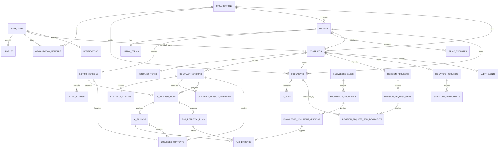

> 기준: 특별상 과제 요구사항 + 외국인 개인 바이어/셀러 와이어프레임 반영 v1.4
> 
> 
> 현재 적용 순서: `001_initial_schema.sql`부터 `011_listing_form_alignment.sql`까지 파일명 순서대로 적용
> 

기존 migration에 없던 Figma 정렬용 컬럼·테이블은 후속 번호의 migration으로 추가한다.
이미 적용된 migration은 수정하지 않는다.

AI 중간 데이터와 역할별 분석은 `AI_UPSTAGE_ARCHITECTURE.md`, RAG 저장·검색·근거 연결은 `RAG_KNOWLEDGE_BASE.md`를 따른다.

## 1. 핵심 변경

와이어프레임은 기존의 “바이어가 계약을 작성해 셀러에게 전송”하는 구조보다 “셀러가 계약 가능한 공고를 게시하고 바이어가 선택”하는 구조에 가깝다. 따라서 다음 두 aggregate를 분리한다.

- `listings`: 셀러의 공개 상품/계약 공고. 같은 공고를 여러 바이어가 탐색한다.
- `contracts`: 특정 외국인 개인 바이어와 셀러 업체 사이의 실제 협상·서명 건.

단체 여행도 계약 당사자인 buyer는 개인이다. `buyer_group_name`과 `requested_people`은 여행 그룹의 문맥을 저장하며 별도 법인·organization을 만들지 않는다. MVP의 단체서명은 `group_representative` 개인 1명이 단체를 대표해 서명하는 방식이다.

공고에서 계약이 시작될 때 `listing_versions`와 `listing_clauses`를 `contract_versions`와 `contract_clauses`로 복사한다. 이후 공고를 수정해도 진행 중인 계약은 바뀌지 않는다.

특별상 과제 기준의 상품 분류와 지원 언어는 다음 값으로 고정한다.

| 구분 | DB 값 | 화면 표시 |
| --- | --- | --- |
| 상품 | `vehicle_rental` | 자동차 렌탈 |
| 상품 | `activity` | 액티비티 |
| 상품 | `tour` | 투어 |
| 상품 | `accommodation` | 숙박 |
| 언어 | `ko-KR` | 한국어 |
| 언어 | `en-US` | English |
| 언어 | `ja-JP` | 日本語 |
| 언어 | `zh-CN` | 简体中文 |

`contract_category`와 `supported_locale` enum을 API, AI schema, RAG metadata의 공통 source of truth로 사용한다.

AI 실행은 FastAPI 고정 workflow와 Solar Pro 3 단일 `contract_review` Agent를 결합한다. 파싱·추출·초안·요약·번역은 고정 task이며, 계약 위험 검토만 제한된 도구 호출 Agent로 기록한다.

## 2. ERD



## 3. 사용자와 조직

### `profiles`

| 컬럼 | 의미 |
| --- | --- |
| `id` | `auth.users.id` |
| `username` | UI 표시/검색용 unique 별칭. 로그인은 이메일 사용 |
| `display_name`, `phone` | 담당자 기본 정보 |
| `country_code`, `locale` | 바이어 국가/화면 언어. locale은 `ko-KR/en-US/ja-JP/zh-CN` |
| `preferred_currency` | 예상 가격 표시 통화 |
| `affiliation_name`, `business_type` | 개인 바이어의 선택적 소속명·활동 업종. 계약 당사자 조직을 의미하지 않음 |
| `default_group_name` | 선택적인 기본 여행 단체명 |
| `active_organization_id`, `active_business_role` | 현재 역할 컨텍스트 |

비밀번호와 password hash는 저장하지 않는다. 이메일·비밀번호 변경은 Supabase Auth가 담당한다.

### `organizations`

| 컬럼 | 의미 |
| --- | --- |
| `organization_type` | `buyer` 또는 `seller` |
| `verification_status` | `pending`, `verified`, `rejected` |
| `business_registration_no` | 셀러 검증 정보 |
| `representative_name`, `business_address` | Figma 셀러 가입 화면의 대표자와 사업장 정보 |
| `supply_categories` | 제공 가능한 상품 카테고리 배열. 공고 하나의 category와는 별도 |
| `rating_average`, `rating_count` | 상세 화면 표시용 집계값 |

`organization_members.job_title`은 셀러 담당자의 선택적 직책이다. 사업자등록증 document는 `organization_id`에 연결하고 `purpose=business_verification`으로 구분한다.

바이어는 Supabase Auth 사용자와 `profiles`로 표현하며 buyer organization을 자동 생성하지 않는다. 단체명은 개인 profile 또는 특정 contract의 선택 정보일 뿐 별도 계약 당사자가 아니다.

`organizations`와 `organization_members`는 MVP에서 셀러 업체와 그 담당자 권한에 사용한다. 기존 `organization_type=buyer` 값은 이전 스키마 호환을 위해 남아 있을 수 있지만 신규 개인 바이어 가입에서는 생성하지 않는다.

셀러는 `pending` 상태에서도 draft 공고를 만들 수 있지만 `verified` 전에는 publish할 수 없다. 실제 검증 자동화가 없는 MVP에서는 관리자 seed 또는 승인 script로 상태를 바꾼다.

## 4. 셀러 공고

### `listings`

공개 카드와 상태를 담당한다.

| 컬럼 | 의미 |
| --- | --- |
| `seller_organization_id` | 공고 소유 셀러 |
| `status` | draft/processing/ready/published/paused/expired/archived |
| `creation_method` | manual/upload |
| `title`, `display_title` | 내부/공개 제목 |
| `district` | 부산 구 단위 지역 |
| `category` | 자동차 렌탈/액티비티/투어/숙박 |
| `seller_description` | AI 요약 근거가 되는 셀러 설명 |
| `public_headline` | 셀러가 직접 입력한 공개 카드 한 줄 소개 |
| `ai_summary` | 공개 카드 한 줄 요약 |
| `hero_document_id` | 대표 이미지 document |
| `current_version_id` | 현재 공개/편집 계약 버전 |
| `popularity_score`, `view_count`, `contract_request_count` | 정렬용 지표 |

`published_at`, `paused_at`, `expires_at`로 공개 수명주기를 기록한다.

별도 `contract_available` boolean은 저장하지 않는다. API는 `status=published`이면 true, `status=paused`이면 false로 계산한다.

### Figma 정렬용 migration

초기 001~004에 없던 아래 필드와 테이블은 후속 migration으로 추가했다. 인증 가입 화면의
프로필·조직 필드는 `010_auth_account_profiles.sql`이 담당한다.

- 개인 바이어 선택 정보: `profiles.affiliation_name`, `profiles.business_type`
- 셀러 가입 정보: `organizations.representative_name`, `business_address`, `supply_categories`, `organization_members.job_title`
- 사업자 검증 문서의 `documents.organization_id` 소유권과 `business_verification` purpose
- 공고 조건: `people_per_unit`, 노쇼·해지·특약
- 계약 계산 snapshot: 명시 수량·단위·박수
- 서명 전 합의: `contract_version_approvals`

### `listing_terms`

공고 폼과 필터에 필요한 현재 구조화 조건이다.

- 공급 시작/종료일
- 공급 수량과 단위
- 화면에 입력한 공급 수량 문구(`supply_quantity_description`)
- 최소/최대 실제 공급 수량(`minimum_quantity`, `maximum_quantity`)
- 단위당 기본 인원(`people_per_unit`, 선택). 가격 계산 시 이를 가정값으로 숨기지 않고 화면에 표시한다.
- 기준 단가, 통화, 가격 단위
- 최소/최대 인원
- 취소 조건
- 노쇼 조건
- 환불 조건
- 정산 조건
- 안전 조건
- 보상 조건
- 책임·면책 조건
- 계약 해지 조건
- 특약 사항
- 가격 표시 기준과 계약 가능 안내

`008_seller_listing_alignment.sql`은 초기 schema에 없던 `people_per_unit`, `no_show_policy`, `termination_policy`, `special_terms`를 추가한다. `people_per_unit`은 입력된 경우 양수여야 하며 서버가 객실당 인원 같은 값을 임의로 추론하지 않는다. 계약 요청 존재 여부를 빠르게 확인하도록 `contracts(listing_id)` partial index도 추가한다.

`011_listing_form_alignment.sql`은 프론트 공고 작성 폼을 손실 없이 저장하기 위해 `public_headline`, `supply_quantity_description`, `minimum_quantity`, `maximum_quantity`를 추가한다. 공급 수량과 여행 인원은 서로 다른 개념이므로 최소·최대 수량을 기존 `minimum_people`/`maximum_people`에 대신 저장하지 않는다.

### `listing_versions`, `listing_clauses`

AI 계약 생성은 현재 `listing_versions`를 수정하지 않는다. 입력 version을 대상으로
`contract_generate` AI job과 organization idempotency record를 먼저 만들고 listing을
`processing`으로 전이한다. 검증된 결과만 새 `listing_versions`와 순서가 지정된
`listing_clauses`로 추가하며 같은 transaction에서 `current_version_id`와 상태를 `ready`로
변경한다. 실패한 job은 `failed`로 남기고 미완료 idempotency record를 제거해 재시도를 허용한다.

- OCR 추출 또는 AI 생성 결과를 immutable version으로 보존한다.
- `(listing_id, version_no)`는 unique다.
- publish된 버전을 수정하지 않고 새 version을 만든다.
- 공개 시 buyer 관점 AI 분석을 별도로 실행한다.
- manual 공고 생성 시 빈 V1을 만들고 terms 임시저장마다 기존 행을 수정하지 않은 채 구조화 snapshot과 clauses를 가진 새 version을 만든다.
- 계약 요청이 하나라도 연결된 뒤에는 listing terms 변경을 차단한다. 기존 contract snapshot과 listing version은 계속 immutable하게 보존한다.

### `price_estimates`

계약 요청에 실제로 사용된 예상 가격과 결과 근거를 저장한다. 공개 화면에서 조건을 바꿀 때마다 실행되는 preview 계산은 기본적으로 저장하지 않는다.

- 입력 인원, 실제 과금 수량·단위, 박수/기간, 표시 통화
- 결과 금액
- 계산 방식 `deterministic`, `historical_adjusted`
- 사용한 기준 단가와 환율 metadata
- AI 설명과 confidence

LLM이 숫자를 직접 계산한 값을 source of truth로 사용하지 않는다.

## 5. 실제 계약과 협상

### `contracts`

`listing_id`를 통해 원 공고를 추적한다. `buyer_user_id`는 외국인 개인 계약 당사자이며, `seller_organization_id`는 국내 관광업체다. 계약 생성 시 다음을 snapshot한다.

- buyer 개인의 이름·국가·연락처와 seller organization
- 선택적 여행 단체명, 인원수, 서명 자격(`self|group_representative`)
- listing current version/clauses
- 요청 인원, 실제 과금 수량·단위, 박수와 서비스 기간
- 당시 계산된 예상 가격/통화

`buyer_organization_id`는 이전 B2B 구조와 기존 데이터 호환을 위한 nullable legacy 컬럼이다. 신규 계약 권한과 조회는 `buyer_user_id`를 기준으로 한다. `listing_id`는 nullable로 두어 향후 직접 등록 계약이나 기존 계약 import도 지원한다.

### `contract_parties`

계약 생성 당시 당사자 정보를 snapshot한다.

- seller party: `organization_id`와 업체명/사업자 정보 snapshot
- buyer party: `user_id`와 개인 이름/국가/연락처 snapshot
- 단체 여행: `group_name_snapshot`, `group_size_snapshot`, `signing_capacity=group_representative`

개인 profile이 나중에 수정되어도 체결 당시 party snapshot은 변경하지 않는다.

### `contract_versions`, `contract_clauses`

협상 결과는 기존 내용을 update하지 않고 새 version으로 만든다. `contracts.current_version_id`만 최신 버전을 가리킨다. 서명 요청은 특정 version에 고정된다.

`contract_versions.structured_data.contract_terms`에는 version 생성 당시의 가격과 통화,
서비스 시작일·종료일과 계산 근거를 snapshot한다. 버전 비교는 이 저장값만 사용하며 기존
version에 snapshot이 없으면 가격·기간 변화를 알 수 없는 값으로 처리한다.

작성자 역할은 `created_by`가 계약 buyer인지 seller organization member인지 조회해 계산한다.
최초 version의 생성 사유는 `contract_created`, `created_from_revision_request_id`가 있는
version은 `revision_agreement`, 그 외 version은 `manual_version`으로 표시한다.

위험도 비교는 version에 연결된 가장 최근의 성공한 buyer 관점 `ai_analysis_runs`와
`ai_findings`를 사용한다. 비교 시 AI 분석을 새로 실행하지 않는다.

### `contract_version_approvals`

`007_contract_version_approvals.sql`에서 추가하는 서명 전 최종 승인 기록이다. 계약 상태를 추가하지 않고 특정 immutable version에 대한 당사자 동의만 저장한다.

| 컬럼 | 의미 |
| --- | --- |
| `contract_version_id` | 승인한 계약 버전 |
| `party_role` | `buyer` 또는 `seller` |
| `approved_by_user_id` | 실제 승인 사용자 |
| `approved_at` | 승인 시각 |
| `created_at` | 승인 행 생성 시각 |

`contract_version_id`는 `contract_versions.id`, `approved_by_user_id`는 `auth.users.id`를 참조하며 둘 다 삭제를 제한한다. `(contract_version_id, party_role)`은 unique다. trigger가 승인 행의 update/delete를 막아 기록을 immutable하게 유지한다. RLS 조회 정책은 해당 version이 속한 계약의 buyer 또는 seller organization member에게만 허용한다.

새 계약 version이 생겨도 이전 승인 행을 복사하거나 재사용하지 않는다. 이전 version의 기록은 감사 목적으로 남지만, buyer와 seller가 모두 동일한 현재 version을 승인해야 계약을 `signing`으로 전이하고 이후 signature request를 생성할 수 있다.

### `revision_requests`

| 컬럼 | 의미 |
| --- | --- |
| `status` | draft/sent/accepted/rejected/partially_accepted/countered/cancelled |
| `contract_version_id` | 요청이 기준으로 삼은 버전 |
| `requested_by_role` | buyer 또는 seller |
| `message` | 전체 요청 설명 |
| `decision_message` | 셀러의 전체 판단 메시지 |
| `response_message` | counter/부분 수락에 대한 바이어 메시지 |
| `sent_at`, `decided_at` | 전송/결정 시각 |
| `responded_at` | 바이어가 셀러 판단에 응답한 시각 |

### `revision_request_items`

12-2 항목별 판단 화면의 source of truth다.

| 컬럼 | 의미 |
| --- | --- |
| `clause_id` | 수정 대상 조항. 새 조항 추가라면 null 가능 |
| `request_type` | `modify`, `delete`, `add` |
| `reason` | 바이어/셀러 요청 사유 |
| `requested_text` | 요청자가 원하는 문구. `delete`는 null |
| `decision` | pending/accepted/rejected/countered |
| `decision_reason` | 상대방 판단 사유 |
| `counter_text` | 상대방 대안 문구 |

`modify`는 `clause_id`와 `requested_text`가 모두 필요하고, `delete`는 `clause_id`만
필요하며, `add`는 `requested_text`만 필요하다. `clause_id`는 revision의 기준
contract version에 속해야 한다.

모든 item이 결정되어야 revision 전체 결과를 확정한다. `reject-all`은 각 item을
rejected로 일괄 업데이트하는 편의 동작이다. 모두 수락된 결과는 즉시 새 immutable
contract version으로 만들고, 부분 수락이나 counter는 바이어가 응답한 뒤 새 version으로
만든다. `계약 안하기`는 contract를 cancelled로 바꾸고 열린 revision도 cancelled 처리한다.

### `revision_request_item_documents`

| 컬럼 | 의미 |
| --- | --- |
| `revision_request_item_id` | 첨부 대상 revision item |
| `document_id` | 기존 contract 소유 document |
| `created_at` | 연결 시각 |

두 id의 조합은 primary key이므로 같은 문서를 같은 item에 중복 연결할 수 없다. DB trigger와
애플리케이션 권한 검사로 document가 revision과 같은 contract에 속하는지 확인한다. 파일
업로드 자체는 이 기능의 범위가 아니다.

## 6. 파일·AI

### `documents`

`organization_id`, `listing_id/listing_version_id` 또는 `contract_id/contract_version_id`에 연결할 수 있다. 소유 대상은 정확히 하나만 지정한다.

| purpose | 용도 |
| --- | --- |
| `source_contract` | 셀러가 올린 PDF/DOCX/이미지 |
| `business_verification` | 셀러 사업자등록증 등 검증 문서 |
| `reference` | AI 참고 자료 |
| `listing_hero` | 공개 카드 대표 이미지 |
| `draft_pdf` | 서명 전 렌더링 PDF |
| `signed_contract` | 서명 완료 PDF |
| `audit_trail` | 서명 이력 PDF |
| `parsed_artifact` | Document Parse 결과 JSON |

사용자 계약 원본은 Supabase Storage에 두고 Document Parse/Information Extract 결과를 조항별로 직접 분석한다. 실제 Upstage 제품 adapter가 Universal Extraction 명칭을 사용하더라도 내부 job/API 명칭은 과제 요구사항에 맞춰 `information_extract`로 통일한다. 사용자 계약서는 공용 Vector Store에 올리지 않는다. 별도로 검수한 공식 근거와 승인 템플릿만 Upstage Files/Vector Store에 두며, DB에는 전용 knowledge registry와 provider id, 처리 상태를 저장한다.

`parsed_artifact` JSON은 migration `013`에서 추가한 private `ai-artifacts` Storage bucket에
보관한다. 원본 document의 `extracted_data`에는 7개 필수 추출 영역, provenance,
`confirmation_required`, validation warning과 listing 후보를 저장한다. 이 후보는 셀러 확인 전까지
실제 listing version이나 terms를 생성·수정하지 않는다.

업로드 요청에서 받은 `expected_mime_type`, `expected_size_bytes`,
`expected_content_sha256`는 신뢰하지 않는 비교 기준으로 보존한다. `complete`가 Storage object를
직접 streaming 검증한 뒤에만 실제 `mime_type`, `size_bytes`, `content_sha256`를 기록하고
상태를 `uploaded`로 변경한다.

### `ai_jobs`, `ai_analysis_runs`, `ai_findings`

AI target은 listing version 또는 contract version 중 정확히 하나다.

- seller 분석: 공고 작성 중 셀러에게 불리한 조항 점검
- buyer 분석: 공개 원문 화면에서 바이어에게 모호하거나 불리한 조항 점검
- 공개 API는 buyer 분석만 반환한다.
- 모든 finding은 모델명, prompt version, evidence와 disclaimer를 가진다.

`014_ai_contract_review_agent.sql`은 `ai_analysis_runs`에 다음 실행 metadata를 추가한다.

| 컬럼 | 의미 |
| --- | --- |
| `execution_mode` | `fixed_task` 또는 `single_agent` |
| `agent_name` | Agent 실행이면 `contract_review`, 고정 task면 null |
| `max_iterations` | 허용된 최대 도구 반복 횟수. MVP는 2 |
| `iterations_used` | 실제 수행한 반복 횟수 |
| `stop_reason` | `completed`, `max_iterations`, `insufficient_evidence`, `provider_error` |
| `execution_metadata` | 사용한 tool 이름, 호출 순서, schema version 등 비민감 metadata |

원문 prompt, 전체 계약서, API 응답 전문은 `execution_metadata`에 저장하지 않는다. RAG knowledge
base 단계에서는 Agent의 각 File Search 호출을 `rag_retrieval_runs`에 별도 행으로 남기고,
최종 채택된 근거만 `rag_evidence`에 고정한다.

`ai_findings.is_public`은 시스템이 승인한 buyer finding만 공개 API에 노출하기 위한 값이다.
seller 관점 결과는 Agent 출력과 무관하게 항상 `false`로 저장된다. 이 branch에서는 채택한
검색 결과의 제한된 metadata를 `ai_findings.evidence` snapshot에도 보존하며, knowledge registry와
연결된 정규화 `rag_retrieval_runs`/`rag_evidence` 기록은 RAG knowledge base 단계에서 완성한다.

finding 적용은 `suggested_text_sha256`, 분석 대상 version, resource의 현재 version을 한
transaction에서 잠그고 검증한다. 기존 version/clause 행은 유지한 채 새 immutable version과
clause snapshot을 생성하고 `applied_version_id`에 새 version id를 기록한다. 적용과 기각 이력은
`audit_events`에 append-only로 저장하며, 중복 action은 `idempotency_records`의 24시간 결과
snapshot을 재사용한다.

### RAG knowledge registry

공식 법령·행정규칙·표준약관과 팀 승인 템플릿은 사용자 파일용 `documents`에 섞지 않고 다음 전용 테이블로 관리한다.

| 테이블 | 의미 |
| --- | --- |
| `knowledge_bases` | 공식/템플릿 corpus와 Upstage Vector Store 연결 |
| `knowledge_documents` | 논리 문서, 출처, 권위 수준, 공식 URL, 적용 상품 카테고리 |
| `knowledge_document_versions` | 시행일, hash, immutable Storage 경로, Upstage file id, active/superseded 상태 |
| `rag_retrieval_runs` | analysis별 한국어 query, metadata filter, top-k와 provider 요청 기록 |
| `rag_evidence` | finding별 고정 근거의 rank, score, page, section, excerpt, bbox |
| `localized_contents` | 공고·계약·finding의 한국어/영어/일본어/중국어 결과 cache |

공개 공고 localization은 `content_type=public_listing`으로 저장한다. unique key에 immutable target,
locale, prompt version과 source hash를 모두 포함하며 `numeric_validation_passed=true`인 행만 공개
API가 사용할 수 있다. locale별 AI job과 저장 transaction을 분리하므로 일부 locale 실패 시 다른
locale 행은 유지된다. `content`에는 번역·쉬운 설명과 함께 보존된 구조화 facts, clause/finding ID,
조항·근거 번호 및 고유명사 목록을 저장한다.

AI 패널의 근거 번호는 `rag_evidence.id`를 가리킨다. 문서가 개정되어도 체결·분석 당시 사용한 `knowledge_document_versions` snapshot을 유지해 같은 페이지와 인용을 재현한다.

MVP 공식 자료는 PDF를 그대로 Upstage Files/Vector Store에 적재한다. `knowledge_document_versions.metadata`에는 `file_format=pdf`, `is_searchable`, `parse_required`, `original_page_count`를 기록한다. Markdown 정규화 경로는 nullable이며 필수 ingestion 단계가 아니다. 국내여행 표준약관은 `common`에 한 번만 저장하고 `contract_categories={tour}`로 제한한다.

## 7. 전자서명

### `signature_requests`

- `provider_template_id`: 모두싸인 templateId
- `provider_document_id`: 요청 응답 id
- `provider_status`: ON_PROCESSING/ON_GOING/COMPLETED raw 값
- `current_signing_order`: 모두싸인 현재 순서
- `signed_document_id`, `audit_trail_document_id`: Storage에 복사한 최종 파일

### `provider_events`

모두싸인 웹훅 원본 전체를 그대로 로그에 남기지 않고 식별값과 정규화 결과를 저장한다.

- `(provider, provider_event_id)` unique로 중복 웹훅을 막는다.
- `payload_hash`로 같은 event id의 변조된 재전송을 감지한다.
- `processed`, `processing_error`, `processed_at`으로 재처리 상태를 추적한다.
- 완료 PDF와 audit trail의 Storage 복사가 성공한 뒤에만 signature request와 contract를 `completed/signed`로 바꾼다.

### `signature_participants`

`provider_role_name`은 모두싸인 템플릿의 `바이어`, `셀러`와 정확히 일치해야 한다. buyer participant에는 개인 바이어의 이름과 이메일을 사용한다.

단체 대표 서명에서는 `represents_group_name`, `represents_group_size`, `representation_confirmed_at`을 기록한다. 이는 대표자 1명의 서명이며 참가자 전원의 서명이 아니다. 대표 권한 확인 문구와 계약 version은 `audit_events`에도 남긴다.

테스트에서는 같은 이메일을 두 역할에 쓸 수 있으므로 unique 기준은 이메일이 아니라 `(signature_request_id, party_role)`다.

모두싸인 인증 이메일/API 키는 DB에 저장하지 않고 서버 secret 환경변수로만 주입한다.

## 8. 인덱스와 목록 조회

공개 탐색:

- `(status, category, district, published_at desc)`
- `(status, popularity_score desc)`
- `(status, base_price_amount_minor)`는 `listing_terms` join을 고려해 별도 검색 view 또는 query 사용
- 공급 기간 `(service_start_date, service_end_date)`

셀러 화면:

- `(seller_organization_id, status, updated_at desc)`
- 계약 `(seller_organization_id, status, updated_at desc)`

바이어 마이페이지:

- `(buyer_user_id, status, updated_at desc)`
- 기간 종료 버킷용 `contract_terms(service_end_date)`

알림:

- `(user_id, created_at desc, id desc)`로 본인 최신 알림을 조회한다.
- `dedupe_key`는 선택값이며 `(user_id, dedupe_key)` partial unique index로 같은 사용자에게
  공고 만료 예정 또는 최종안 승인 요청이 반복 생성되는 것을 막는다.
- 공고 만료 예정 dedupe key는 공고 id와 공급 종료일을 포함하므로 종료일이 바뀌면 새
  일정에 대한 알림을 생성할 수 있다.
- `read_at`은 최초 읽음 시각을 보존하며 읽지 않음으로 되돌리지 않는다.
- revision과 approval domain transaction에서 생성되는 계약 알림은 해당 업무 변경과
  함께 commit한다. 전자서명 알림 생성은 signature 구현 브랜치가 연결한다.

계약 감사 이력:

- `audit_events`는 append-only이며 기존 행을 수정하거나 삭제하지 않는다.
- 계약 당사자 API에는 이벤트 종류, actor 역할, 대상과 비민감 event data만 반환하고
  `actor_user_id`는 노출하지 않는다.

검색 규모가 커지면 title/display_title에 `pg_trgm` GIN index를 사용한다.

## 9. Storage

| bucket | 공개 여부 | 용도 |
| --- | --- | --- |
| `listing-assets` | private | 대표 이미지. API가 짧은 signed URL 발급 |
| `contract-documents` | private | 원본 계약서 |
| `contract-artifacts` | private | parse JSON과 draft PDF |
| `signed-contracts` | private | 완료 PDF와 audit trail |
| `rag-knowledge` | private | 공식/템플릿 PDF 원본 snapshot, 선택적 parse/page artifact, manifest |
| `business-verification` | private | 셀러 가입·검증 문서 |

```
{seller_org_id}/listings/{listing_id}/{document_id}/original.pdf
{seller_org_id}/verification/{document_id}/{original_filename}
{seller_org_id}/listings/{listing_id}/{document_id}/parsed.json
{seller_org_id}/listings/{listing_id}/hero/{document_id}.{ext}
{seller_org_id}/contracts/{contract_id}/{version_id}/draft.pdf
{seller_org_id}/contracts/{contract_id}/{signature_request_id}/signed.pdf
{seller_org_id}/contracts/{contract_id}/{signature_request_id}/audit-trail.pdf
```

## 10. RLS와 공개 접근

- 공개 browsing은 FastAPI의 `/public` endpoint가 service role로 필요한 컬럼만 projection한다. 기간이 유효한 `published`와 `paused`만 조회하며 `paused`에는 `contract_available=false`를 계산해 반환한다.
- 브라우저가 Supabase 테이블을 직접 조회해 계약 원문이나 내부 finding을 가져가지 않는다.
- seller listing 쓰기는 seller organization member만 가능하다.
- `publish`는 organization이 verified인지 domain service에서 확인한다.
- 계약/수정 요청/서명 정보는 `buyer_user_id = auth.uid()`인 개인 바이어 또는 seller organization 구성원만 접근한다.
- organization 검증 문서는 해당 seller organization의 owner/admin과 승인된 운영 검증자만 접근한다.
- `profiles`, `notifications`는 본인만 조회한다.
- `audit_events`, `provider_events`, `ai_*`는 클라이언트 직접 쓰기를 허용하지 않는다.

FastAPI service role은 RLS를 우회하므로 repository 호출 전 개인 바이어는 `actor_user_id`, 셀러는 `organization_id`와 membership을 검증한다.

## 11. 개인정보와 보안

- 비밀번호는 Supabase Auth에만 저장한다.
- API 키, service role key, 실제 계약 원문을 Git이나 로그에 남기지 않는다.
- 공개 공고 API는 사업자번호, 담당자 전화번호/이메일을 반환하지 않는다.
- AI prompt log에 원문 계약이나 개인정보를 평문으로 기록하지 않는다.
- provider download URL은 만료될 수 있으므로 즉시 Storage로 복사한다.
- 공고를 비공개 처리해도 이미 체결된 contract와 감사 로그는 삭제하지 않는다.

## 12. 데모 seed

| 엔티티 | 값 |
| --- | --- |
| Seller | 해운대 오션스테이, verified, accommodation |
| Listing | 2026 부산 여름 객실 공급, published, 해운대구 |
| Listing terms | 7~8월, 객실당 2명, 15실·2박 예시, 145,000 KRW/room-night, 최소 20명 |
| Buyer | Yuki Tanaka, JP, ja-JP, JPY, 선택 단체명 `GlobalTrip 여행 모임` |
| Contract request | 개인 대표자, 30명 단체, 2박, 취소 조건 수정 요청 |
| Finding | 취소 수수료 확정 시점 모호 `medium` |
| Revision items | 취소 기한 변경, 인원 변경 조항 추가 |
| Locales | ko-KR 원문, ja-JP 데모, en-US/zh-CN 동일 pipeline 결과 |

실제 auth UUID와 API credential은 migration seed에 고정하지 않는다.
