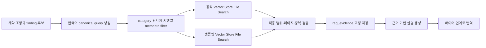

# 찍어보소 RAG 지식베이스 설계

> 버전: Special-challenge-aligned MVP v1.1  
> 작성 기준일: 2026-07-28  
> 관련 문서: `AI_UPSTAGE_ARCHITECTURE.md`, `API_SPEC.md`, `DB_SCHEMA.md`  
> 범위: 외국인 개인 바이어와 부산 관광 셀러의 계약 검토·작성 보조

## 1. 결론

개발 환경의 기본 흐름은 다음과 같다.

```text
공식 사이트 원문 다운로드
→ 로컬 staging에서 파일·시행일·hash 검수
→ Supabase Storage에 immutable 원본/정규화본 보관
→ Upstage Files API로 업로드
→ 용도별 Vector Store에 연결
→ File Search
→ 검색 결과의 문서·페이지·조항을 DB evidence로 고정
→ 화면의 [1], [2] 클릭 시 내부 문서 뷰어의 해당 페이지로 이동
```

따라서 “로컬에 저장한 뒤 Files API를 거쳐 Vector Store에 저장한다”는 이해는 개발·수집 단계에서는 맞다. 다만 운영 기준은 다음과 같이 잡는다.

- 로컬 디렉터리는 수집·검수·업로드용 staging이지 운영 source of truth가 아니다.
- 운영 원본과 버전 snapshot은 Supabase Storage가 source of truth다.
- 검색용 file/vector index는 Upstage가 담당한다.
- File Search가 page metadata를 반환하지 않으면 private 원본 PDF에서 excerpt를 매칭해 page를
  결정하며, 매칭하지 못한 결과는 clickable evidence로 저장하지 않는다.
- 문서 metadata, 버전, hash, 검색 실행과 인용 결과는 Supabase PostgreSQL이 담당한다.
- 셀러가 업로드한 사용자 계약서는 공용 RAG Vector Store에 넣지 않는다.
- 공식 근거 문서와 팀 작성 템플릿은 서로 다른 Vector Store로 분리한다.
- 두 Vector Store 안에서 자료를 `common`, `vehicle_rental`, `activity`, `tour`, `accommodation`으로 분류하고 검색 metadata filter에 사용한다.

## 2. 저장소별 책임

| 저장소 | 저장 대상 | Git 포함 | 역할 |
|---|---|---:|---|
| Git `rag/` | manifest, schema, 수집·검증 script, 평가 dataset | 예 | 재현 가능한 ingestion 코드와 문서 목록 |
| 로컬 `rag/data/` | 다운로드한 원본, 변환본, page artifact | 아니요 | 개발자의 일시적 staging/cache |
| Supabase Storage `rag-knowledge` | 검수 완료 원본, 정규화본, page artifact, manifest snapshot | 아니요 | 운영 원본과 버전 보관 |
| Supabase PostgreSQL | 문서 registry, 버전, provider id, retrieval run, evidence | 해당 없음 | 상태·권한·추적성의 source of truth |
| Upstage Files | 검색에 투입한 파일 | 해당 없음 | Vector Store 연결 전 provider 파일 |
| Upstage Vector Store | 임베딩·검색 index | 해당 없음 | File Search 대상 |

### Vector Store 분리

| 환경변수 | 권장 store 이름 | 포함 자료 | 결과 표시 |
|---|---|---|---|
| `UPSTAGE_OFFICIAL_VECTOR_STORE_ID` | `official_contract_knowledge` | 법령, 행정규칙, 공정위 표준약관, 공식 지침 | `[근거]`로 인용 가능 |
| `UPSTAGE_TEMPLATE_VECTOR_STORE_ID` | `busan_link_templates` | 팀이 검토·승인한 계약 템플릿과 clause library | `[작성 참고]`로만 표시 |
| `UPSTAGE_CASE_VECTOR_STORE_ID` | `case_reference` | 팀이 승인한 공식 판례 snapshot | `[판례 참고]`로 인용 가능 |

`approved_historical_contracts`는 MVP에서 만들지 않는다. 실제 과거 계약에는 개인정보·영업정보가 포함될 수 있고, 비식별화와 사용 동의가 별도로 필요하다.

## 3. 권장 Git 디렉터리 구조

```text
rag/
├── README.md
├── .gitignore
├── manifests/
│   ├── official_sources.yaml
│   └── template_sources.yaml
├── schemas/
│   ├── source_manifest.schema.json
│   └── evidence.schema.json
├── scripts/
│   ├── fetch_sources.py
│   ├── normalize_sources.py
│   ├── validate_sources.py
│   ├── upload_upstage.py
│   └── evaluate_retrieval.py
├── eval/
│   ├── golden_queries.yaml
│   └── expected_evidence.yaml
└── data/                         # 전체 Git 제외
    ├── official/
    │   ├── common/{raw,normalized,pages}/
    │   ├── vehicle_rental/{raw,normalized,pages}/
    │   ├── activity/{raw,normalized,pages}/
    │   ├── tour/{raw,normalized,pages}/
    │   └── accommodation/{raw,normalized,pages}/
    └── templates/
        ├── common/{raw,normalized,pages}/
        ├── vehicle_rental/{raw,normalized,pages}/
        ├── activity/{raw,normalized,pages}/
        ├── tour/{raw,normalized,pages}/
        └── accommodation/{raw,normalized,pages}/
```

| 경로 | 저장 파일 예시 | 규칙 |
|---|---|---|
| `manifests/official_sources.yaml` | source URL, download URL, 시행일, hash | secret 없이 Git에 커밋 |
| `manifests/template_sources.yaml` | 템플릿 버전, 승인자, 카테고리 | 승인되지 않은 초안은 `active` 금지 |
| `schemas/` | manifest/evidence JSON Schema | ingestion과 API 응답을 같은 schema로 검증 |
| `scripts/` | 수집·정규화·업로드·평가 script | API key는 환경변수만 사용 |
| `eval/` | 검색 질문과 기대 문서·조항 | 개인정보가 없는 synthetic dataset만 커밋 |
| `data/{corpus}/{category}/raw/` | PDF, HWP, HTML 원본 | Git 제외, 다운로드 파일명 규칙 적용 |
| `data/**/normalized/` | Markdown 또는 JSON | page/조항 metadata를 잃지 않음 |
| `data/**/pages/` | 페이지별 text/bbox JSON | 근거 클릭 하이라이트에 사용 |

### 파일명 규칙

```text
{source_key}__{effective_date}__{retrieved_date}.{ext}
```

예:

```text
consumer_dispute_resolution_standards__2025-12-18__2026-07-28.pdf
tourism_promotion_act__2026-05-12__2026-07-28.pdf
accommodation_contract_template__v1.0.0__2026-07-28.md
```

URL의 파일명을 그대로 쓰지 않는다. 파일명만으로 문서와 시행 기준일을 식별할 수 있어야 한다.

## 4. Supabase Storage 구조

버킷 이름은 `rag-knowledge` 하나로 두고 object prefix로 corpus를 분리한다.

```text
rag-knowledge/
├── official/{category}/{source_key}/{version_id}/
│   ├── original.pdf
│   ├── normalized.md
│   ├── manifest.json
│   └── pages/page-0001.json
└── templates/{category}/{source_key}/{version_id}/
    ├── original.md
    ├── normalized.md
    ├── manifest.json
    └── pages/page-0001.json
```

저장 원칙:

- 기존 object를 덮어쓰지 않고 새 `version_id` prefix를 만든다.
- `sha256`, 다운로드 시각, 공식 source URL, 시행일을 `manifest.json`과 DB 양쪽에 기록한다.
- 원본과 정규화본은 private bucket에 저장한다.
- 브라우저에는 짧은 만료시간의 signed URL만 발급한다.
- Upstage의 임시 download URL이나 signed URL을 DB에 영구 저장하지 않는다.

한 문서가 여러 카테고리에 적용되더라도 원본을 여러 번 업로드하지 않는다. `common`에 한 번 저장하고 `contract_categories` metadata 배열로 네 카테고리와 연결한다.

## 5. MVP 공식 문서 목록과 다운로드 링크

아래 링크는 파일이 변경될 수 있는 공식 원문·다운로드 화면이다. 최초 ingestion 시 해당 화면에서 PDF 원문을 내려받고 실제 시행일과 개정 번호를 manifest에 고정한다. `현재 기준`은 2026-07-28에 확인한 값이며, 서비스가 법률 적용 여부를 자동 확정한다는 의미가 아니다.

### 카테고리별 분류표

| RAG 분류 | 필수로 다룰 조건 | 우선 문서 | template 경로 |
|---|---|---|---|
| `vehicle_rental` 자동차 렌탈 | 대여료, 보증금, 보험, 자기부담금, 사고, 수리비, 휴차료, 연료, 반납 | 자동차대여 표준약관, 소비자분쟁해결기준, 공통 소비자 법령 | `templates/vehicle_rental/` |
| `activity` 액티비티 | 운영 조건, 최소 인원, 기상 취소, 안전수칙, 보험, 사고, 보상·책임 | 소비자분쟁해결기준, 관광진흥법, subtype별 안전 법령 | `templates/activity/` |
| `tour` 투어 | 일정, 구성 서비스, 가이드, 최소 인원, 변경, 취소·환불, 추가 비용 | 국내여행표준약관, 관광통역안내표준약관, 관광진흥법 | `templates/tour/` |
| `accommodation` 숙박 | 객실, 체크인/아웃, 취소, 환불, 노쇼, 시설 안전, 보상 | 소비자분쟁해결기준, 관광진흥법과 하위법령 | `templates/accommodation/` |
| `common` 공통 | 중요 약관 설명, 온라인 청약, 소비자 분쟁, 시행일 | 약관규제법, 소비자기본법, 전자상거래 소비자보호법 | `templates/common/` |

분류는 폴더 정리뿐 아니라 검색 filter다. 예를 들어 자동차 렌탈 finding은 `common + vehicle_rental`만 검색하고 투어/숙박 template는 제외한다. 액티비티는 `common + activity + activity_subtype`까지 적용한다.

### P0: 데모 전에 반드시 수집·검수

| source key / 저장 파일 | 자료와 용도 | 현재 확인 기준 | 공식 원문·다운로드 | 적용 주의 |
|---|---|---|---|---|
| `consumer_dispute_resolution_standards`<br>`common/consumer_dispute_resolution_standards__2025-12-18__2026-07-28.pdf` | 네 카테고리의 취소·환불·서비스 분쟁 기준 후보 | 2025-12-18 시행, 공정위 고시 제2025-14호 | [국가법령정보센터 다운로드 화면](https://www.law.go.kr/행정규칙/소비자분쟁해결기준) | 법원의 확정 판결이나 자동 강행규정이 아니라 합의·권고 기준이라는 성격을 표시 |
| `car_rental_standard_terms`<br>`vehicle_rental/car_rental_standard_terms__2021-10-29__2026-07-28.hwp` | 렌탈 요금·인도점검·수리비·보험·자기부담금·사고 처리 | 공정위 제10064호, 2021-10-29 개정 | [공정거래위원회 자동차대여 표준약관 다운로드](https://www.ftc.go.kr/www/selectBbsNttView.do?bordCd=201&key=202&nttSn=11133&pageIndex=7&pageUnit=10&searchCnd=all) | 실제 적용 약관과 보험 계약을 함께 확인하고 자동 책임 판정 금지 |
| `domestic_travel_standard_terms`<br>`tour/domestic_travel_standard_terms__current__2026-07-28.hwp` | 투어 서비스의 계약·취소·일정 변경 조항 작성 참고 | 공정위 제10020호, 업로드 전 최신 첨부 재확인 | [공정거래위원회 표준약관 목록·다운로드](https://www.ftc.go.kr/www/selectBbsNttList.do?bordCd=201&key=202&pageIndex=4&pageUnit=10&searchCnd=all) | 여행업 계약에 관한 표준약관이므로 개별 호텔·액티비티 직계약에 자동 적용된다고 표현 금지 |
| `water_leisure_safety_act`<br>`activity/water_leisure_safety_act__current__2026-07-28.pdf` | 요트·수상 액티비티의 안전, 등록, 보험 근거 후보 | ingestion 시 현행 시행일 고정 | [국가법령정보센터 원문 다운로드](https://www.law.go.kr/법령/수상레저안전법) | 수상 종목에만 적용하며 모든 액티비티에 확대 적용 금지 |
| `terms_regulation_act`<br>`terms_regulation_act__current__2026-07-28.pdf` | 중요 조항 설명, 모호하거나 일방적인 약관 검토 근거 후보 | ingestion 시 현행 시행일 고정 | [국가법령정보센터 원문 다운로드](https://www.law.go.kr/법령/약관의규제에관한법률) | 특정 조항의 무효·위법 여부를 AI가 단정하지 않음 |
| `consumer_framework_act`<br>`consumer_framework_act__2026-01-02__2026-07-28.pdf` | 개인 바이어/사업자 관계와 분쟁해결 체계의 상위 배경 | 2026-01-02 시행 | [국가법령정보센터 원문 다운로드](https://www.law.go.kr/법령/소비자기본법) | 구체적 환불률의 직접 근거처럼 사용하지 않음 |
| `tourism_promotion_act`<br>`common/tourism_promotion_act__2026-05-12__2026-07-28.pdf` | 투어·숙박·일부 액티비티의 관광사업 정의와 제도적 범위 | 2026-05-12 시행, 법률 제21087호 | [국가법령정보센터 원문 다운로드](https://www.law.go.kr/법령/관광진흥법) | 정의·등록 범위와 개별 계약 책임 판단을 구분 |
| `ecommerce_consumer_protection_act`<br>`ecommerce_consumer_protection_act__2026-07-21__2026-07-28.pdf` | 온라인 청약·표시·철회 관련 근거 후보 | 2026-07-21 시행, 법률 제21312호 | [국가법령정보센터 원문 다운로드](https://www.law.go.kr/법령/전자상거래등에서의소비자보호에관한법률) | 찍어보소의 실제 거래 구조·중개 지위에 따라 적용 가능성이 달라지므로 사전 검토 필요 |

### P1: 카테고리 확장 시 수집

| source key / 저장 파일 | 자료와 용도 | 공식 원문·다운로드 | 우선순위 |
|---|---|---|---:|
| `tourism_promotion_act_enforcement_decree`<br>`tourism_promotion_act_enforcement_decree__2026-05-12__2026-07-28.pdf` | 관광사업의 세부 종류와 등록 기준 | [국가법령정보센터 원문 다운로드](https://www.law.go.kr/법령/관광진흥법시행령) | P1 |
| `tourism_promotion_act_enforcement_rule`<br>`tourism_promotion_act_enforcement_rule__current__2026-07-28.pdf` | 시행령의 세부 절차·서식·시설 기준 | [국가법령정보센터 원문 다운로드](https://www.law.go.kr/법령/관광진흥법시행규칙) | P1 |
| `tour_interpreter_standard_terms`<br>`tour_interpreter_standard_terms__current__2026-07-28.hwp` | 가이드/통역 상품 계약 참고 | [공정거래위원회 표준약관 목록·다운로드](https://www.ftc.go.kr/www/selectBbsNttList.do?bordCd=201&key=202&pageIndex=4&pageUnit=10&searchCnd=all) | P1 |

액티비티는 `activity_subtype`을 필수 metadata로 둔다. `water`, `land`, `indoor`, `extreme` 등 subtype이 확정된 뒤 해당 종목의 소관 법령과 공식 안전 지침만 추가한다. 여러 종목의 자료를 한꺼번에 검색하면 적용 대상이 다른 근거가 섞일 수 있다.

## 6. 팀 작성 템플릿 파일 목록

팀 템플릿은 외부 법적 근거가 아니며, 공식 corpus와 섞지 않는다.

| source key / 파일 | 내용 | 필수 metadata | 상태 |
|---|---|---|---|
| `vehicle_rental_contract_template_v1.md` | 대여료·보증금·보험·자기부담금·사고·휴차료·반납 | `category=vehicle_rental` | P0 |
| `activity_contract_template_v1.md` | 운영일·최소인원·기상취소·안전수칙·보험·책임 | `category=activity`, `activity_subtype` | P0 |
| `tour_contract_template_v1.md` | 일정·구성 서비스·최소인원·변경·취소·환불 | `category=tour` | P0 |
| `accommodation_contract_template_v1.md` | 객실·체크인·노쇼·취소·환불·시설 안전 | `category=accommodation` | P0 |
| `cancellation_clause_library_v1.md` | 무료 취소·부분 환불·노쇼 대안 문구 | 적용 카테고리와 작성 근거 | P0 |
| `settlement_clause_library_v1.md` | 결제·정산 시점과 환불 방식 문구 | 통화·지급 주체·시점 | P0 |
| `safety_compensation_liability_clause_library_v1.md` | 네 카테고리별 안전·보상·책임/면책 문구 | 적용 카테고리·subtype·제외 조건 | P0 |

템플릿의 `approved_by`, `approved_at`, `version`, `change_note`가 없으면 Vector Store의 active 문서로 올리지 않는다.

## 7. Manifest 기준

```yaml
source_key: consumer_dispute_resolution_standards
title: 소비자분쟁해결기준
corpus: official
source_type: administrative_rule
authority: Korea Fair Trade Commission
jurisdiction: KR
language: ko-KR
contract_categories:
  - vehicle_rental
  - activity
  - tour
  - accommodation
party_type: B2C_individual
source_url: https://www.law.go.kr/행정규칙/소비자분쟁해결기준
download_url: null
effective_from: 2025-12-18
effective_to: null
retrieved_at: 2026-07-28T00:00:00+09:00
content_sha256: "<sha256>"
local_path: data/official/common/raw/consumer_dispute_resolution_standards__2025-12-18__2026-07-28.pdf
storage_object_path: official/common/consumer_dispute_resolution_standards/<version-id>/original.pdf
upstage_file_id: null
upstage_vector_store_id: null
status: reviewed
applicability_note: 합의 또는 권고 기준이며 개별 계약에 대한 법률 판정이 아님
```

### 필수 상태

```text
discovered → downloaded → normalized → reviewed → uploaded → indexed → active
                                                            ↘ failed
active → superseded | revoked
```

- `reviewed` 전에는 Upstage에 업로드하지 않는다.
- 같은 `content_sha256`가 이미 있으면 중복 업로드하지 않는다.
- 새 버전이 `active`가 되면 이전 버전은 `superseded` 처리한다.
- 검색 filter는 기본적으로 `status=active`와 계약 기준일에 유효한 버전만 허용한다.

## 8. DB registry 구조

현재 `documents`는 사용자 계약 파일 중심이므로 공식 RAG 자료를 같은 테이블에 섞지 않는다.

| 테이블 | 핵심 컬럼 | 목적 |
|---|---|---|
| `knowledge_bases` | `id`, `code`, `corpus_type`, `upstage_vector_store_id`, `status` | 공식/템플릿 corpus와 provider store 연결 |
| `knowledge_documents` | `id`, `source_key`, `title`, `source_type`, `authority`, `source_url`, `jurisdiction`, `contract_categories` | 논리 문서와 자동차 렌탈·액티비티·투어·숙박 분류 |
| `knowledge_document_versions` | `id`, `document_id`, `version_label`, `effective_from/to`, `retrieved_at`, `content_sha256`, `storage_object_path`, `upstage_file_id`, `status`, `metadata` | immutable 문서 버전과 ingestion 상태 |
| `rag_retrieval_runs` | `id`, `analysis_run_id`, `query`, `filters`, `knowledge_base_version`, `top_k`, `provider_request_id`, `created_at` | 어떤 검색으로 근거를 찾았는지 감사 가능하게 기록 |
| `rag_evidence` | `id`, `retrieval_run_id`, `finding_id`, `document_version_id`, `rank`, `score`, `page_start/end`, `section_path`, `excerpt`, `bbox`, `chunk_id` | 화면에 노출하는 고정 인용 |

기본 테이블은 `004_rag_challenge_alignment.sql`에, 판례 corpus와 provider attachment runtime
필드는 `015_rag_knowledge_base_runtime.sql`에 반영한다. `ai_findings.evidence` JSON은 화면용
번호 snapshot으로만 사용하고 clickable 근거의 source of truth는 `rag_evidence`로 둔다.

기본 업로드 형식은 검수 PDF다. provider가 유효한 장문 PDF를 parsing하지 못한 경우 원본은
Storage에 그대로 두고 페이지 마커가 포함된 텍스트 파생물만 검색 index에 재시도할 수 있다.
`metadata.provider_retry_mode`와 `provider_content_sha256`가 파생물 생성 방식과 hash를 보존한다.

## 9. Chunk와 page metadata

Upstage File Search 응답에는 page/section/bbox가 포함되지 않을 수 있다. 이때 서버는
`upstage_file_id`로 immutable 원본을 찾고 검색 excerpt와 PDF 페이지 텍스트의 token overlap을
비교해 `page_start/page_end`를 결정한다. page를 찾지 못하면 grounded evidence로 채택하지 않는다.

검색에 올리는 각 chunk는 다음 metadata를 유지한다.

```json
{
  "document_version_id": "uuid",
  "corpus": "official",
  "source_type": "administrative_rule",
  "authority": "Korea Fair Trade Commission",
  "jurisdiction": "KR",
  "language": "ko-KR",
  "contract_categories": ["vehicle_rental", "activity", "tour", "accommodation"],
  "activity_subtypes": ["water"],
  "party_type": "B2C_individual",
  "effective_from": "2025-12-18",
  "effective_to": null,
  "status": "active",
  "page_start": 31,
  "page_end": 31,
  "section_path": "별표 2 > 숙박업 > 취소",
  "chunk_index": 42,
  "content_sha256": "..."
}
```

권장 chunk 기준:

- 법령: 조 단위, 긴 조문은 항 단위
- 별표·표준약관: 제목/품목/조항 경계를 유지한 300~800 token 단위
- 표: 행 제목과 열 제목을 각 행 본문에 반복해 의미를 보존
- 서로 다른 페이지의 내용을 하나의 chunk로 합치지 않는 것을 우선
- overlap은 50~100 token 범위에서 사용하되 조항 경계를 넘지 않음

페이지 번호와 조항 경로가 없는 chunk는 화면 인용에 사용하지 않는다. 검색 보조 후보로는 쓸 수 있지만 `grounding_status=grounded`를 만드는 최종 evidence에는 채택하지 않는다.

## 10. 검색 흐름



검색 규칙:

1. 한국어·영어·일본어·중국어 어느 화면에서도 검색 query는 먼저 한국어 canonical query로 만든다.
2. `contract_category`, `party_type=B2C_individual`, 계약 기준일을 filter로 적용한다.
3. 공식 자료와 템플릿을 각각 검색한다.
4. 같은 문서·같은 조항의 중복 chunk를 제거한다.
5. 공식 근거가 없으면 템플릿을 법적 근거처럼 승격하지 않는다.
6. 적용 대상이나 시행일이 불분명하면 `insufficient_evidence`로 처리한다.
7. 근거가 확정된 한국어 설명을 만든 뒤 영어·일본어·중국어로 번역한다.
8. 번역 후 금액·날짜·비율·근거 번호가 보존됐는지 코드로 검사한다.

## 11. 근거 번호 클릭과 문서 페이지 이동

### 화면 응답

```json
{
  "finding_id": "F-001",
  "title": "무료 취소 기한이 명확하지 않습니다",
  "evidence_refs": [
    {
      "id": "uuid-evidence-1",
      "label": "[1]",
      "title": "소비자분쟁해결기준",
      "page": 31,
      "section": "별표 2 > 숙박업",
      "excerpt": "검색 결과에서 확정한 짧은 근거 문장",
      "source_kind": "official"
    }
  ]
}
```

### API

```http
GET /api/v1/ai-findings/{finding_id}/evidence/{evidence_id}
```

응답:

```json
{
  "data": {
    "evidence_id": "uuid-evidence-1",
    "document_title": "소비자분쟁해결기준",
    "page": 31,
    "section": "별표 2 > 숙박업",
    "excerpt": "검색 결과에서 확정한 짧은 근거 문장",
    "viewer_url": "/knowledge/versions/uuid-version/view?page=31&evidence=uuid-evidence-1",
    "signed_pdf_url": "https://private-storage.example/signed-short-lived-url",
    "signed_url_expires_at": "2026-08-02T00:05:00Z",
    "official_source_url": "https://www.law.go.kr/행정규칙/소비자분쟁해결기준",
    "effective_from": "2025-12-18",
    "retrieved_at": "2026-07-28T00:00:00+09:00",
    "disclaimer": "법률 자문이 아닌 계약 검토 보조 의견입니다."
  }
}
```

### 이동 방식

1. 사용자가 AI 패널에서 `[1]`을 클릭한다.
2. API가 해당 finding을 볼 권한과 evidence 소속을 확인한다.
3. API가 private Storage snapshot의 짧은 signed URL과 page/bbox를 반환한다.
4. 프론트는 PDF.js 기반 내부 viewer에서 `page=31`로 이동한다.
5. `bbox`가 있으면 해당 문장을 노란색으로 하이라이트한다.
6. viewer에는 `공식 원문 열기` 버튼도 표시한다.

단순히 `signed-url#page=31`만 사용하는 방식은 브라우저마다 동작이 다르고 정확한 문장 하이라이트가 어렵다. MVP도 가능하면 PDF.js viewer route를 두고, 시간이 부족할 때만 `#page=N`을 fallback으로 사용한다.

공식 사이트의 현재 문서가 나중에 개정되어도 체결 당시 AI가 사용한 근거는 내부 immutable snapshot으로 재현한다. 동시에 공식 원문 버튼을 제공해 사용자가 최신 문서를 확인할 수 있게 한다.

## 12. 사용자 계약서와 RAG의 경계

셀러가 올린 계약서는 다음 pipeline만 거친다.

```text
Supabase Storage contract-documents
→ Document Parse
→ Information Extract(Upstage Universal Extraction adapter)
→ 조항별 direct review
→ 공식/템플릿 Vector Store에서 근거 검색
```

사용자 계약서 자체를 공용 Upstage Vector Store에 넣지 않는다. 이유:

- 다른 셀러·바이어 검색에 노출될 가능성을 구조적으로 차단해야 한다.
- 계약서에는 이름, 이메일, 전화번호, 사업자정보, 가격 등 민감정보가 있을 수 있다.
- 한 계약 원문은 이미 target document이므로 semantic retrieval 없이 조항 id로 직접 읽을 수 있다.
- 삭제 요청과 계약 보존기간을 공용 knowledge lifecycle과 분리해야 한다.

향후 사용자별 private 검색이 꼭 필요하면 tenant별 store 또는 provider의 확실한 ACL/삭제 보장을 검증한 뒤 별도 설계한다.

## 13. 보안과 신뢰성

- 공식 문서와 사용자 계약 문구를 모두 untrusted input으로 취급한다.
- 문서 안의 “이전 지시를 무시하라” 같은 문장은 명령이 아니라 인용 대상 text로만 처리한다.
- 검색 결과가 모델의 system rule, JSON Schema, 권한 범위를 변경할 수 없게 한다.
- excerpt는 DB에 저장하기 전에 원문 chunk의 substring인지 검증한다.
- 화면 excerpt는 필요한 최소 길이만 노출한다.
- Upstage API key와 Vector Store ID는 서버 환경변수에만 둔다.
- provider 검색 filter와 별도로 DB에서 active hash·시행일·party type·category를 다시 검증한다.
- raw provider 응답과 원문 전체를 application log에 남기지 않는다.
- 공개 공고에서는 buyer 관점의 승인된 evidence만 반환하고 seller 내부 finding은 숨긴다.

## 14. 검색 평가

`rag/eval/golden_queries.yaml`에는 개인정보 없는 질문을 카테고리별 최소 5개, 총 20개 이상 둔다.

| 범주 | 예시 질문 | 기대 검증 |
|---|---|---|
| 자동차 렌탈 | 사고 시 모든 책임을 소비자가 부담 | 자동차대여 표준약관의 보험·자기부담금 관련 조항 후보 검색 |
| 자동차 렌탈 | 휴차료와 수리비 산정 기준 누락 | 렌탈 외 카테고리 문서 제외 |
| 액티비티 | 요트 사고 시 사업자 전면 면책 | 수상 subtype의 안전·보험 근거 후보 검색 |
| 액티비티 | 기상 취소와 최소 운영 인원 누락 | 안전 근거와 계약 템플릿을 서로 다른 badge로 표시 |
| 투어 | 일정 변경 시 환불 불가 | 국내여행 표준약관의 관련 조항 후보 검색 |
| 투어 | 대표자 1명이 30명 단체를 대표 | 근거 없는 대표 권한 보증 금지 |
| 숙박 | 체크인 전 취소 기준 누락 | 숙박 품목/조항이 top-k에 존재 |
| 숙박 | 노쇼 위약금 기준 누락 | 투어 표준약관만 반환하지 않음 |

평가 지표:

- `Recall@5`: 기대 문서/조항이 상위 5개에 포함되는 비율
- citation precision: 표시한 근거가 실제 설명을 지지하는 비율
- page accuracy: 표시 페이지가 실제 excerpt 위치와 일치하는 비율
- stale-document rate: superseded 문서가 결과에 포함되는 비율
- insufficient-evidence accuracy: 근거가 없을 때 억지 인용을 만들지 않는 비율
- cross-category leakage: 한 카테고리 질문에 무관한 렌탈·액티비티·투어·숙박 근거가 섞이는 비율

데모 전에는 핵심 경고인 `환불 불가`, `사고 시 사업자 전면 면책`, `보상 기준 누락`, `취소 기준 누락`에 대해 page accuracy와 citation precision을 사람이 직접 확인한다.

## 15. 갱신 운영

해커톤 기간에는 자동 crawler보다 수동 승인 ingestion이 안전하다.

```text
공식 페이지 변경 확인
→ 새 파일 다운로드
→ 이전 hash와 비교
→ 시행일·개정번호 확인
→ 팀원 1명 검수
→ 새 version 업로드/index
→ smoke query 통과
→ 새 version active
→ 이전 version superseded
```

운영 주기 권장:

- 데모 직전: 모든 P0 문서 시행일과 hash 재확인
- 해커톤 MVP: 수동 갱신
- 실제 서비스: 주 1회 변경 감지 + 사람 승인
- 체결된 계약의 evidence: 당시 snapshot을 삭제하지 않고 보존 정책에 따름

## 16. 구현 순서와 브랜치

| 순서 | 브랜치 | 커밋 | 결과 |
|---:|---|---|---|
| 1 | `feat/rag-knowledge-base` | `docs(rag): define sources storage and citation flow` | 이 문서와 공식 자료 manifest 기준 |
| 2 | `feat/rag-knowledge-base` | `feat(rag): add knowledge registry schema` | knowledge base/document/version/retrieval/evidence migration |
| 3 | `feat/rag-knowledge-base` | `feat(rag): add source manifest validation` | YAML/JSON Schema와 hash·시행일 검증 |
| 4 | `feat/rag-knowledge-base` | `feat(rag): upload reviewed sources to Upstage` | Files API upload, Vector Store 연결, idempotency |
| 5 | `feat/rag-knowledge-base` | `feat(rag): persist grounded retrieval evidence` | 검색 run과 page-level evidence 저장 |
| 6 | `feat/rag-knowledge-base` | `feat(rag): add evidence viewer endpoint` | 근거 권한 확인, signed URL, page/bbox 응답 |
| 7 | `feat/rag-knowledge-base` | `test(rag): add retrieval and citation evaluation` | golden query, stale 문서, page 정확성 테스트 |

AI 분석 브랜치 `feat/ai-contract-review`는 이 브랜치가 제공하는 retrieval service를 호출한다. 두 브랜치가 충돌하지 않도록 RAG 브랜치는 지식 registry·검색·evidence API에 집중하고, AI 브랜치는 finding 생성과 grounded synthesis에 집중한다.

## 17. 구현 전 체크리스트

- [ ] 실제 Upstage Files/Vector Store/File Search endpoint와 지원 형식을 현재 공식 문서에서 재확인
- [ ] P0 공식 파일을 직접 다운로드하고 시행일·개정번호 확인
- [ ] 모든 원본의 SHA-256 기록
- [ ] Supabase `rag-knowledge` private bucket 생성
- [ ] 공식/템플릿 Vector Store 분리
- [ ] 모든 문서에 common/vehicle_rental/activity/tour/accommodation 분류와 적용 대상 검수
- [ ] 액티비티 문서에 subtype filter 적용
- [ ] 사용자 계약서가 공용 Vector Store로 전송되지 않는 테스트 추가
- [ ] page/section/bbox가 없는 결과는 clickable evidence에서 제외
- [ ] `[1]` 클릭 시 권한 검사와 page 이동 확인
- [ ] 공식 근거와 작성 참고를 UI에서 다른 badge로 표시
- [ ] `insufficient_evidence` 문구와 법률 자문 아님 고지 확인

## 18. 기술 참고

- [Upstage File Search](https://console.upstage.ai/docs/capabilities/search/file-search)
- [Upstage Document Parse](https://console.upstage.ai/docs/capabilities/parse/document-parsing)
- [국가법령정보센터](https://www.law.go.kr/)
- [공정거래위원회 표준약관](https://www.ftc.go.kr/www/selectBbsNttList.do?bordCd=201&key=202)

외부 API의 endpoint, 파일 제한, metadata filter 지원 범위는 변경될 수 있으므로 구현 시 공식 문서를 다시 확인한다. provider가 필요한 metadata filter를 직접 지원하지 않으면 DB에서 active document version allowlist를 만든 뒤 검색 결과를 후처리한다.
